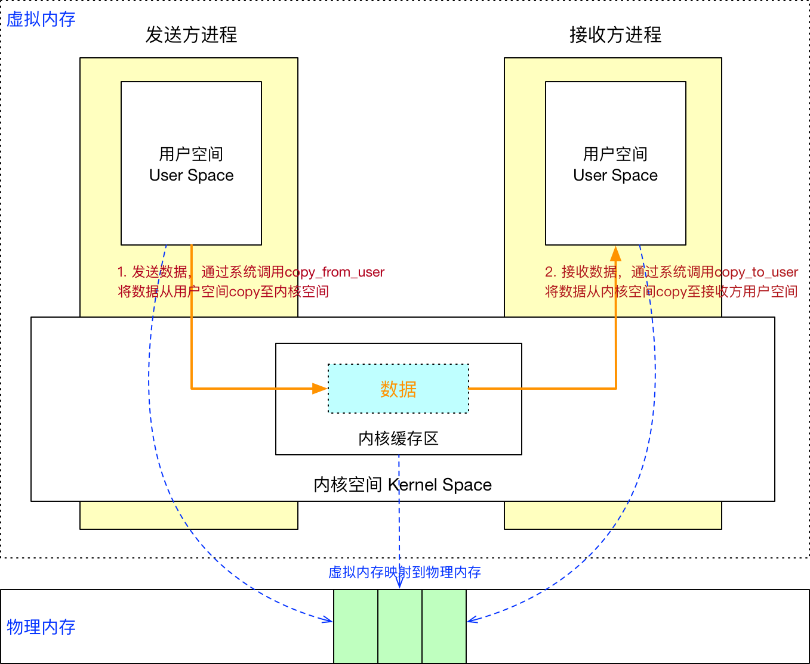
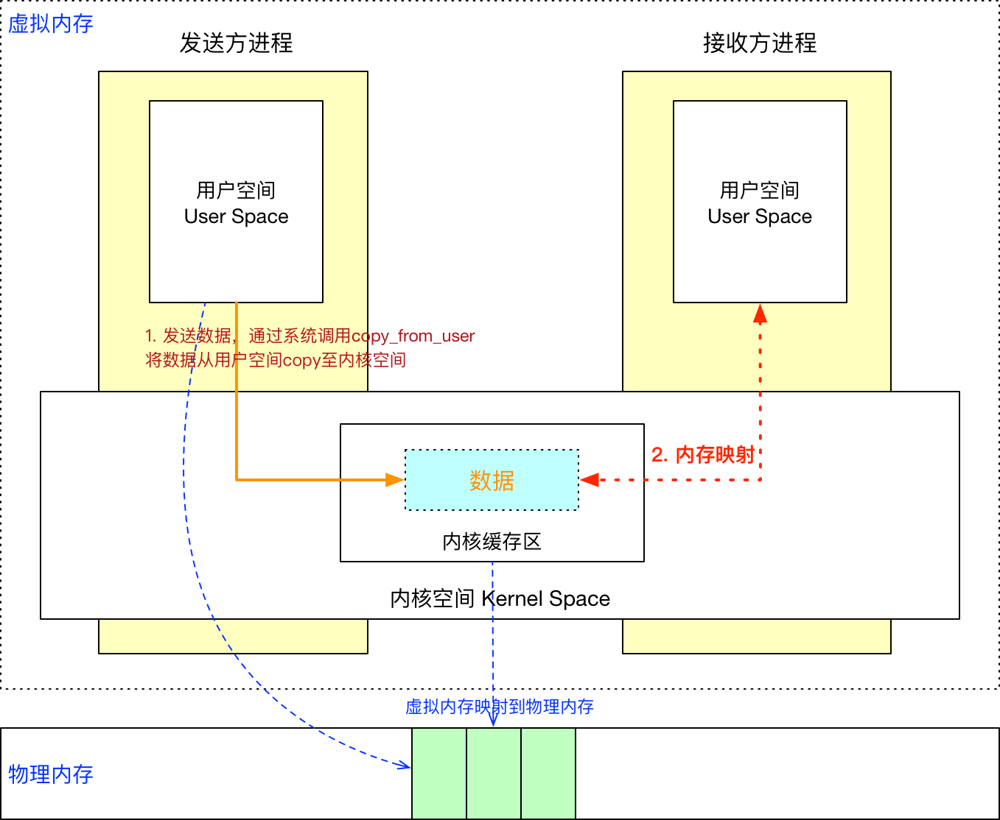
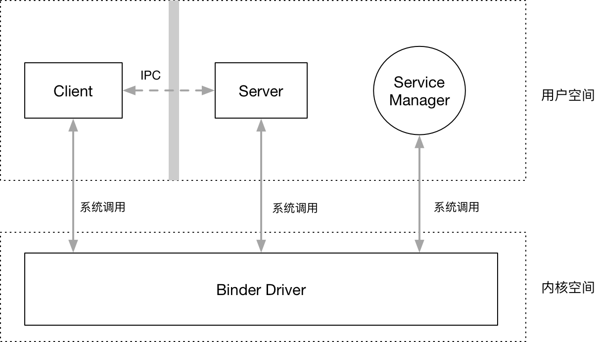
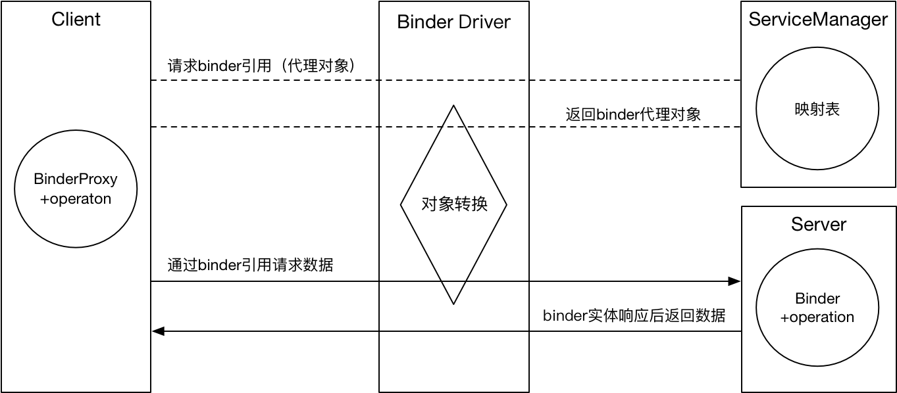

# 关于Binder，作为应用开发者你需要知道的全部

# 为什么要理解Binder？

一般Android应用开发很少直接用到跨进程信通信（IPC），但如果你想知道：

* App是如何启动并初始化的？
* Activity的启动过程是怎样的？
* 进程间是如何通信的？
* AIDL的具体原理是什么？
* 众多插件化框架的设计原理 等等

就必须对Binder有所了解，无论是四大组件，还是各种系统Service，比如ActivityManagerService、PackageManagerService，它们的实现都依赖Binder的通信机制，可见Binder在Android系统中的重要性，可以说Binder是迈入高级工程师的第一步。

Binder机制很复杂，想要彻底弄懂比较难，除了需要了解操作系统中的各种知识外，还需要看懂Binder驱动层的代码实现。最近看了很多关于Binder的文章，大部分过于抽象或者过于深入源码细节，真正浅显易懂的文章很少。个人认为最有参考价值的是以下三篇：（其他参考文章附在文末）

- [Android Binder设计与实现 - 设计篇](https://blog.csdn.net/universus/article/details/6211589)
- [Binder学习指南](http://weishu.me/2016/01/12/binder-index-for-newer/)
- [写给 Android 应用工程师的 Binder 原理剖析](https://zhuanlan.zhihu.com/p/35519585)

这篇文章主要**从宏观的层面去理解Binder中的各种概念和基本通信过程，只关注Java层的实现，底层实现不做介绍。**对于应用开发者而言，理解Binder的基本设计原理和通信过程已经够了，想要深入理解Binder需要自行阅读源码。

**本文主要从三个方面来做分析：**

1. **为什么是Binder？**
   * 传统Linux IPC机制的缺点
   * Linux的一些基本知识
   * 传统Linux IPC机制的通信原理
2. **Binder的基本原理**
   * Binder的底层原理
   * Binder的通信模型
   * Binder的代理机制
   * 对Binder概念的重新理解
3. **通过代码来理解Binder**
   * 通过AIDL实例来了解Binder的用法
   * 通过手动编码实现ActivityManagerService

# 1. 为什么是Binder？

## 1.1 传统IPC机制的缺点

大家都知道Android系统是基于Linux内核实现的，Linux已经提供了多种进程间通信机制，比如：管道、消息队列、共享内存和套接字（Socket）等等，为什么还要再实现一套IPC机制呢？主要是基于两方面的原因：

### 1.1.1 性能角度

管道、消息队列、Socket实现一次进程通信都需要2次内存拷贝，效率太低；共享内存虽然不需要拷贝内存，但管理复杂；Binder只需要一次内存拷贝，从性能角度来看，低于共享内存方式，优于其它方式。

| IPC机制                | 数据拷贝次数 |
| ---------------------- | ------------ |
| 共享内存               | 0            |
| Binder                 | 1            |
| 管道、消息队列、Socket | 2            |

### 1.1.2 安全性考虑

传统的IPC机制没有安全措施，接收方无法获得对方可靠的进程ID或用户ID，完全靠上层的协议来保护，比如Socket通信的IP地址是客户端填入的，很可能被恶意程序篡改。Android作为面向终端用户的开源平台，应用市场中有海量的应用供用户选择，因此安全性极为重要。Android系统为每个已安装的App都分配了用户ID（UID），UID是鉴别进程身份的重要标识，通过UID可以进行一系列的权限校验。另一方面 ，传统IPC的接入点是开放的，任何程序都可以根据协议进行访问，无法阻止恶意程序的访问，Android需要一种基于C/S架构的IPC机制，Server端需要能够对Client的请求进行身份校验，来保证数据的安全性。

## 1.2 Linux的一些基本知识

要知道Binder是如何只用一次内存拷贝即实现跨进程通信的，首先需要弄清楚为什么传统IPC机制为什么需要两次内存拷贝，这就需要先了解一些操作系统的基础知识。

### 1.2.1 进程隔离

先来看一下维基百科对“进程隔离”的定义：

> **进程隔离**是为保护操作系统中进程互不干扰而设计的一组不同硬件和软件的技术。这个技术是为了避免进程A写入进程B的情况发生。 进程的隔离实现，使用了虚拟地址空间。进程A的虚拟地址和进程B的虚拟地址不同，这样就防止进程A将数据信息写入进程B。

也就是说，进程之间的数据是不共享的，A进程无法直接访问B进程的数据，以此来保证数据的安全性。在进程隔离的操作系统中，进程之间的交互必须通过IPC机制。

进程隔离的实现使用了虚拟地址空间，什么是虚拟地址空间呢？首先需要了解操作系统中的[虚拟内存](https://zh.wikipedia.org/wiki/%E8%99%9A%E6%8B%9F%E5%86%85%E5%AD%98)概念，它是一种提高编程效率和提高物理内存利用效率的一种技术。简单来说，就是应用程序看到了都一片连续完整的内存地址空间，而实际上这些地坛空间是映射到碎片化的物理内存中的，这个映射的过程对应用程序来说是透明的。这个概念很重要，对于虚拟内存更深入的理解可以参考这篇文章：[Linux 虚拟内存和物理内存的理解](https://www.cnblogs.com/dyllove98/archive/2013/06/12/3132940.html)

### 1.2.2 进程空间：用户空间/内核空间

现在的操作系统都采用虚拟内存，对32位的操作系统而言，寻址空间是2的32次方，即4G。操作系统的核心是内核，内核拥有对底层设备的所有访问权限，因此需要和普通的应用程序独立开来，用户进程不能直接访问内核进程。操作系统从逻辑上把虚拟地址空间划分为用户空间（User Space）和内核空间（Kernel Space）。在32位的Linux操作系统中，将高位的1GB字节供内核使用，称之为内核空间；剩下的3GB字节供用户进程使用，称之为用户空间。

### 1.2.3 系统调用：用户态/内核态

因为用户空间的权限低于内核空间，不可避免用户空间需要访问内核空间的资源，比如读写文件和网络访问，如何实现呢？唯一的方式就是通过操作系统提供的**系统调用**接口，通过系统调用接口，用户程序可以在内核的控制下实现对内核资源的有限访问，这样既能满足应用程序的资源请求，也能保障系统安全和稳定。

当用户进程执行自己的代码时，进程当前就处于用户运行态（用户态），此时处理器执行用户代码，权限较低；当用户进程通过系统调用执行内核代码时，进程就暂时进入了内核运行态（内核态），此时处理器权限最高，可以执行特权指令。

### 1.2.4 内核模块/驱动

前面说了用户空间可以通过系统调用访问内核空间，那用户空间之间（进程间）怎么通信呢？传统的IPC机制都是通过内核来支持的，Binder也一样，有一个运行在内核中的Binder驱动程序负责进程之间Binder的通信。

> 驱动程序一般指的是设备驱动程序（Device Driver），是一种可以使计算机和设备通信的特殊程序。相当于硬件的接口，操作系统只有通过这个接口。

Binder驱动是一种虚拟的字符设备，注册在/dev/binder中，其定义了一套Binder通信协议，负责建立进程间的Binder通信，提供了数据包在进程之间传递的一系列底层支持。应用进程访问Binder驱动也是通过系统调用实现的。

## 1.3 传统IPC机制的通信原理

了解了上面的基础知识后，我们来看看传统IPC机制是如何实现，通常是下面两个步骤（共享内存机制除外）：

1. 发送方进程通过系统调用（copy_from_user）将要发送的数据存拷贝到内核缓存区中。
2. 接收方开辟一段内存空间，内核通过系统调用（copy_to_user）将内核缓存区中的数据拷贝到接收方的内存缓存区。



这种传统IPC机制存在2个问题：

1. 需要进行2次数据拷贝，第1次是从发送方用户空间拷贝到内核缓存区，第2次是从内核缓存区拷贝到接收方用户空间。
2. 接收方进程不知道事先要分配多大的空间来接收数据，可能存在空间上的浪费。

# 2. Binder的基本原理

## 2.1 Binder底层原理

传统IPC机制需要拷贝2次内存，Binder是如何只用1次内存拷贝就实现进程间通信的呢？前面我们已经了解到，Linux是使用的是虚拟内存寻址方式，用户空间的虚拟内存地址是映射到物理内存中的，对虚拟内存的读写实际上是对物理内存的读写，这个过程就是**内存映射**，这个内存映射过程是通过系统调用mmap()来实现的。

Binder借助了内存映射的方法，在内核空间和接收方用户空间的数据缓存区之间做了一层内存映射。这样一来，从发送方用户空间拷贝到内核空间缓存区的数据，就相当于直接拷贝到了接收方用户空间的数据缓存区，从而减少了一次数据拷贝。



## 2.2 Binder通信模型

Binder是基于C/S架构的，对于通信双方来说，发起请求的进程属于Client，接收请求的进程属于Server，由于存在进程隔离，双方不能直接通信，Binder是如何实现的呢？

[写给 Android 应用工程师的 Binder 原理剖析](https://zhuanlan.zhihu.com/p/35519585)中举的网络通信例子很贴切，Binder的通信过程与网络请求类似，网络通信过程可以简化为4个角色：Client、Server、DNS服务器和路由器。一次完整的网络通信大体过程如下：

1. Client输入Server的域名

2. DNS解析域名

   通过域名是无法直接找到相应Server的，必须先通过DNS服务器将Server的域名转化为具体的IP地址。

3. 通过路由器将请求发送至Server

   Client通过DNS服务器解析到Server的IP地址后，也还不能直接向Server发起请求，需要经过路由器的层层中转才还到达Server。

4. Server返回数据

   Server接收到请求并处理后，再通过路由器将数据返回给Client。

在Binder机制中，也定义了4个角色：**Client、Server、Binder驱动和ServiceManager**。

* **Binder驱动**：类似网络通信中的路由器，负责将Client的请求转发到具体的Server中执行，并将Server返回的数据传回给Client。
* **ServiceManager**：类似网络通信中的DNS服务器，负责将Client请求的Binder描述符转化为具体的Server地址，以便Binder驱动能够转发给具体的Server。Server如需提供Binder服务，需要向ServiceManager注册。



**具体的通信过程是这样的：**

1. Server向ServiceManager注册

   Server通过Binder驱动向ServiceManager注册，声明可以对外提供服务。ServiceManager中会保留一份映射表：名字为zhangsan的Server对应的Binder引用是0x12345。

2. Client向ServiceManager请求Server的Binder引用

   Client想要请求Server的数据时，需要先通过Binder驱动向ServiceManager请求Server的Binder引用：我要向名字为zhangsan的Server通信，请告诉我Server的Binder引用。

3. 向具体的Server发送请求

   Client拿到这个Binder引用后，就可以通过Binder驱动和Server进行通信了。

4. Server返回结果

   Server响应请求后，需要再次通过Binder驱动将结果返回给Client。

可以看到，Client、Server、ServiceManager之间的通信都是通过Binder驱动作为桥梁的，可见Binder驱动的重要性。也许你还有一点疑问，ServiceManager和Binder驱动属于两个不同的进程，它们是为Client和Server之间的进程间通信服务的，也就是说Client和Server之间的进程间通信依赖ServiceManager和Binder驱动之间的进程间通信，这就像是：“蛋生鸡，鸡生蛋，但第一个蛋得通过一只鸡孵出来”。Binder机制是如何创造第一只下蛋的鸡呢？

1. 当Android系统启动后，会创建一个名称为_servicemanager_的进程，这个进程通过一个约定的命令_BINDER*SET*CONTEXT_MGR_向Binder驱动注册，申请成为为ServiceManager，Binder驱动会自动为ServiceManager创建一个Binder实体（**第一只下蛋的鸡**）；
2. 并且这个Binder实体的引用在所有的Client中都为0，也就说各个Client通过这个0号引用就可以和ServiceManager进行通信。Server通过0号引用向ServiceManager进行注册，Client通过0号引用就可以获取到要通信的Server的Binder引用。

[Android Binder设计与实现 - 设计篇](https://blog.csdn.net/universus/article/details/6211589)中对Client、Server、Binder驱动和ServiceManager有更详细的介绍。

## 2.3 Binder的代理机制

通过上面的分析，我们已经知道了Binder的基本通信过程：Client向SerivceManger获取到Server的Binder引用，Client通过Binder引用向Server发起具体请求。Client通过这个Binder引用具体是如何调用Server方法的呢？



比如一个Server提供add方法，Client实际请求add的流程是这样的：Client先通过Binder驱动向ServiceManager获取Server的Binder引用，这个引用就是一个Java Object，这个Object有一个add方法；Cient拿到这个Object后就可以直接请求add方法了。

实际上Client拿到的Object并不是Server真正的Binder实体，Binder驱动做了一层**对象转换**，将这个Object包装成了一个代理对象ProxyObject，这个ProxyObject和真正的Binder实体有相同的方法签名，Client通过这个ProxyObject请求add方法时，Binder驱动会自动将请求转发到具体的Binder实体中执行，这就是**Binder的代理机制**。由于ProxyObject和真正的Binder实体有相同的方法签名，其实Client并不需要关心是ProxyObject还是真实的Object。

为了方便描述，下面将Server真正的Binder实体称为**Binder本地对象**；将Client中的Binder引用，即ProxyObject，称之为**Binder代理对象**。

## 2.4 对Binder概念的重新理解

经过上面的分析，我们已经大体清楚了Binder机制的基本通信原理，现在回过头来重新梳理下对Binder机制的认识：

**总体来说，Binder是基于C/S结构的一种面向对象的IPC机制。包含：Client、Server、Binder驱动和ServiceManager四大组成部分。**各组成部分中的Binder含义都有所有不同：

* **对于Client**

  Binder是Server本地对象的一个引用，这个引用实际上是一个代理对象，Client通过这个代理对象来间接访问Server的本地对象；

* **对于Server**

  Binder是提供具体实现的本地对象，需向ServiceManager注册；

* **对于Binder驱动**

  它是连接Client来Server的桥梁，负责将代理对象转化为本地对象，并将Server的执行结果返回给Client。

* **对于ServiceManager**

  它保存了Server Binder字符名称和Binder引用的映射，Client通过它来找到Server的Binder引用。

Binder驱动中保留了Binder代理对象和Binder本地对象的具体结构，由于我们只关心Binder的基本通信机制，底层实现不做过多介绍，想具体了解的同学可以参考[Android Binder设计与实现 - 设计篇](https://blog.csdn.net/universus/article/details/6211589)。

# 3. 通过代码来理解Binder

上面的介绍比较抽象，现在我们通过具体实例来理解Binder。

1. 通过AIDL实例来了解Binder的用法
2. 通过手动编码实现ActivityManagerService

## 3.1 通过AIDL实例来了解Binder的用法

实现Binder通信的最常用方法就是通过aidl，aidl接口定义了Client和Server进行通信的接口，对aidl不了解的同学请参考官方文档[Android 接口定义语言 (AIDL)](https://developer.android.com/guide/components/aidl)。

### 3.1.1 与Binder相关的几个类的职责 

在具体分析之前，我们需要先了解与Binder相关的几个类的职责：

* **IBinder**

  跨进程通信的Base接口，它声明了跨进程通信需要实现的一系列抽象方法，实现了这个接口就说明可以进行跨进程通信，Client和Server都要实现此接口。

* **IInterface**

  这也是一个Base接口，用来表示Server提供了哪些能力，是Client和Server通信的协议。

* **Binder**

  提供Binder服务的本地对象的基类，它实现了IBinder接口，所有本地对象都要继承这个类。

* **BinderProxy**

  在Binder.java这个文件中还定义了一个BinderProxy类，这个类表示Binder代理对象它同样实现了IBinder接口，不过它的很多实现都交由native层处理。Client中拿到的实际上是这个代理对象。

* **Stub**

  这个类在编译aidl文件后自动生成，它继承自Binder，表示它是一个Binder本地对象；它是一个抽象类，实现了IInterface接口，表明它的子类需要实现Server将要提供的具体能力（即aidl文件中声明的方法）。

* **Proxy**

  它实现了IInterface接口，说明它是Binder通信过程的一部分；它实现了aidl中声明的方法，但最终还是交由其中的mRemote成员来处理，说明它是一个代理对象，mRemote成员实际上就是BinderProxy。

### 3.1.2 AIDL实例

首先定义一个aidl文件，这个接口中声明了一个getPid方法：

```java
// IRemoteService.aidl
package com.rush.demo.aidltest;

interface IRemoteService {
    int getPid();
}
```

下面是编译IRemoteService.aild后生成的java类：

```java
// IRemoteService.java
package com.rush.demo.aidltest;

public interface IRemoteService extends android.os.IInterface {
    public static abstract class Stub extends android.os.Binder implements com.rush.demo.aidltest.IRemoteService {
        //Binder描述符
        private static final java.lang.String DESCRIPTOR = "com.rush.demo.aidltest.IRemoteService";

        public Stub() {
            this.attachInterface(this, DESCRIPTOR);
        }

        public static com.rush.demo.aidltest.IRemoteService asInterface(android.os.IBinder obj) {
            if ((obj == null)) {
                return null;
            }
            android.os.IInterface iin = obj.queryLocalInterface(DESCRIPTOR);
            if (((iin != null) && (iin instanceof com.rush.demo.aidltest.IRemoteService))) {
                return ((com.rush.demo.aidltest.IRemoteService) iin);
            }
            return new com.rush.demo.aidltest.IRemoteService.Stub.Proxy(obj);
        }

        @Override
        public android.os.IBinder asBinder() {
            return this;
        }

        @Override
        public boolean onTransact(int code, android.os.Parcel data, android.os.Parcel reply, int flags) throws android.os.RemoteException {
            switch (code) {
                case INTERFACE_TRANSACTION: {
                    reply.writeString(DESCRIPTOR);
                    return true;
                }
                case TRANSACTION_getPid: {
                    data.enforceInterface(DESCRIPTOR);
                    java.lang.String _arg0;
                    _arg0 = data.readString();
                    int _result = this.getPid(_arg0);
                    reply.writeNoException();
                    reply.writeInt(_result);
                    return true;
                }
            }
            return super.onTransact(code, data, reply, flags);
        }

        private static class Proxy implements com.rush.demo.aidltest.IRemoteService {
            private android.os.IBinder mRemote;

            Proxy(android.os.IBinder remote) {
                mRemote = remote;
            }

            @Override
            public android.os.IBinder asBinder() {
                return mRemote;
            }

            public java.lang.String getInterfaceDescriptor() {
                return DESCRIPTOR;
            }

            @Override
            public int getPid(java.lang.String name) throws android.os.RemoteException {
                android.os.Parcel _data = android.os.Parcel.obtain();
                android.os.Parcel _reply = android.os.Parcel.obtain();
                int _result;
                try {
                    _data.writeInterfaceToken(DESCRIPTOR);
                    _data.writeString(name);
                    mRemote.transact(Stub.TRANSACTION_getPid, _data, _reply, 0);
                    _reply.readException();
                    _result = _reply.readInt();
                } finally {
                    _reply.recycle();
                    _data.recycle();
                }
                return _result;
            }
            
        static final int TRANSACTION_getPid = (android.os.IBinder.FIRST_CALL_TRANSACTION + 0);
    }

    public int getPid(java.lang.String name) throws android.os.RemoteException;
}
```

这个文件中有3个类：

1. **IRemoteService**

   继承至IInterface接口，声明了IRemoteService.aidl中声明的getPid方法，它是Client和Service通信的接口。

2. **IRemoteService.Stub**

   IRemoteService的静态抽象内部类，继承自Binder，其子类需要实现IRemoteService接口，表明它是Server的Binder本地对象，需要实现getPid接口。

3. **IRemoteService.Stub.Proxy**

   IRemoteService.Stub的静态内部类，它并没有继承自Binder，而是包含了一个IBinder对象，这个对象其实是BinderProxy，说明它是Server在Client中的本地代理对象。Proxy实现了getPid接口，将参数序列化后交由mRemote（BinderProxy）处理，实际上就是交给Binder驱动来完成与远程Stub的通信。

先来看Stub中的asInterface方法，这个方法通常是Client在bindService成功后，由Client来调用的，作用是将绑定成功后返回的IBinder对象转换为具体的IInterface接口，Client拿到这个IInterface接口后就可以和自由的调用Server提供的方法了。

```java
public static com.rush.demo.aidltest.IRemoteService asInterface(android.os.IBinder obj) {
    if ((obj == null)) {
        return null;
    }
    android.os.IInterface iin = obj.queryLocalInterface(DESCRIPTOR);
    if (((iin != null) && (iin instanceof com.rush.demo.aidltest.IRemoteService))) {
        return ((com.rush.demo.aidltest.IRemoteService) iin);
    }
    return new com.rush.demo.aidltest.IRemoteService.Stub.Proxy(obj);
}
```

asInterface方法中既可能返回Stub本身的IRemoteService对象，也可能创建一个Proxy对象，这是为什么呢？因为Binder虽然是跨进程通信机制，但也可以为本进程服务，也就是说Client和Server可能在同一个进程，在同一个进程就没必要通过Binder驱动来中转了，直接访问就可以了；如果Client和Server在不同的进程，就需要通过Binder代理对象来中转。也就是说：

1. Client和Server在同一个进程，obj是Binder本地对象（Stub的子类），asInterface方法返回的就是Binder本地对象；
2. Client和Server在不同的进程，obj实际上是Binder代理对象，asInterface返回一个Proxy对象。

```java
//Binder.java
/**
 * obj.queryLocalInterface是怎样去查找是否有本地的IInterface呢，从Binder的代码中可以看到，只是简单的比较Binder的描述符和要查找的描述符是否匹配，匹配的话直接返回mOwner，这个mOwner就是Stub构造方法中调用attachInterface方法传入的this参数。
 */
public IInterface queryLocalInterface(String descriptor) {
    if (mDescriptor.equals(descriptor)) {
        return mOwner;
    }
    return null;
}

final class BinderProxy implements IBinder {
    public IInterface queryLocalInterface(String descriptor) {
        return null;
    }
}

public static abstract class Stub extends android.os.Binder implements com.rush.demo.aidltest.IRemoteService {
    // Binder描述符，值为接口类名全称
    private static final java.lang.String DESCRIPTOR = "com.rush.demo.aidltest.IRemoteService";

    public Stub() {
        //向Binder中绑定owner和descriptor
        this.attachInterface(this, DESCRIPTOR);
    }
}
```

obj.queryLocalInterface是怎样去查找是否有本地的IInterface呢，从Binder的代码中可以看到，只是简单的比较Binder的描述符和要查找的描述符是否匹配，匹配的话直接返回mOwner，这个mOwner就是Stub构造方法中调用attachInterface方法传入的this参数。而BinderProxy的queryLocalInterface方法直接返回null。

**Client中通过Binder调用Server方法有两种场景：**

1. **Client和Server在同一个进程**

   Stub.asInterface方法返回的是Stub对象，即Binder本地对象。也就是说和Binder跨进程通信无关，直接调用即可，此时Client调用方和Server响应方在同一个线程中。

2. **Client和Server在不同的进程**

   Stub.asInterface方法返回的是Binder代理对象，需要通过Binder驱动完成跨进程通信。这种场景下，Client调用方线程会被挂起（Binder也提供了异步的方式，这里不讨论），等待Server响应后返回数据。这里要注意的是，Server的响应是在Server进程的Binder线程池中处理的，并不是主线程。

接下来分析跨进程场景下，**Client调用getPid方法的具体流程：**

1. Client调用Binder代理对象，Client线程挂起

   Client中拿到的IRemoteService引用实际上是Proxy，调用getPid方法实际上是调用Proxy的getPid方法，这个方法只是将参数序列化后，调用了mRemote成员的transact方法。Stub类中为IRemoteService中的每个方法定义了方法编号，transact方法中传入getPid方法的编号。**此时Client调用方线程挂起，等待Server响应数据。**

~~~java
// Stub.Proxy
public int getPid(java.lang.String name) throws android.os.RemoteException {
    ...
    _data.writeInterfaceToken(DESCRIPTOR);
    _data.writeString(name);
    mRemote.transact(Stub.TRANSACTION_getPid, _data, _reply, 0);
    _reply.readException();
    _result = _reply.readInt();
    ...
    return _result;
}
~~~

2. Binder代理对象将请求派发给Binder驱动

   Proxy中的mRemote成员实际上是BinderProxy，而BinderProxy中的transact方法最终调用于transactNative方法，也就是说Client的请求派发给了Binder驱动来处理。

3. Binder驱动将请求派发给Server

   Binder驱动经过一系列的处理后，将请求派发给了Server，即调用Server本地Binder对象(Stub)的onTransact方法最终在此方法中完成getPid方法的具体调用。在onTransact方法中，根据Proxy中调用transact时传入的方法编号来区别具体要处理的方法。

```java
// Stub
public boolean onTransact(int code, android.os.Parcel data, android.os.Parcel reply, int flags) throws android.os.RemoteException {
    switch (code) {
        ...
        case TRANSACTION_getPid: {
            data.enforceInterface(DESCRIPTOR);
            //获取方法参数
            java.lang.String _arg0 = data.readString();
            //调用getPid方法，这个方法在Stub的子类，即Server中实现
            int _result = this.getPid(_arg0);
            reply.writeNoException();
            reply.writeInt(_result);
            return true;
        }
    }
    return super.onTransact(code, data, reply, flags);
}
```

4. 唤醒Client线程，返回结果

   onTransact处理结束后，将结果写入reply并返回至Binder驱动，驱动唤醒挂起的Client线程，并将结果返回。至此，一次跨进程通信完成。

## 3.2 手动编码来实现ActivityManagerService

通过前面的示例我们已经知道，aidl文件只是用来定义C/S交互的接口，Android在编译时会自动生成相应的Java类，生成的类中包含了Stub和Proxy静态内部类，用来封装数据转换的过程，实际使用时只关心具体的Java接口类即可。为什么Stub和Proxy是静态内部类呢？这其实只是为了将三个类放在一个文件中，提高代码的聚合性。通过上面的分析，我们其实完全可以不通过aidl，手动编码来实现Binder的通信，下面我们通过编码来实现ActivityManagerService。

首先定义IActivityManager接口：

```java
public interface IActivityManager extends IInterface {
	//binder描述符
    String DESCRIPTOR = "android.app.IActivityManager";
	//方法编号
    int TRANSACTION_startActivity = IBinder.FIRST_CALL_TRANSACTION + 0;
	//声明一个启动activity的方法，为了简化，这里只传入intent参数
    int startActivity(Intent intent) throws RemoteException;
}
```
其次，实现ActivityManagerService侧的本地Binder对象基类：

```java
// 名称随意，不一致叫Stub
public abstract class ActivityManagerNative extends Binder implements IActivityManager {

    public static IActivityManager asInterface(IBinder obj) {
        if (obj == null) {
            return null;
        }
        IActivityManager in = (IActivityManager) obj.queryLocalInterface(IActivityManager.DESCRIPTOR);
        if (in != null) {
            return in;
        }
        //代理对象，见下面的代码
        return new ActivityManagerProxy(obj);
    }

    @Override
    public IBinder asBinder() {
        return this;
    }

    @Override
    protected boolean onTransact(int code, Parcel data, Parcel reply, int flags) throws RemoteException {
        switch (code) {
            // 获取binder描述符
            case INTERFACE_TRANSACTION:
                reply.writeString(IActivityManager.DESCRIPTOR);
                return true;
            // 启动activity，从data中反序列化出intent参数后，直接调用子类startActivity方法启动activity。
            case IActivityManager.TRANSACTION_startActivity:
                data.enforceInterface(IActivityManager.DESCRIPTOR);
                Intent intent = Intent.CREATOR.createFromParcel(data);
                int result = this.startActivity(intent);
                reply.writeNoException();
                reply.writeInt(result);
                return true;
        }
        return super.onTransact(code, data, reply, flags);
    }
}
```

再次，实现Client侧的代理对象：

```java
public class ActivityManagerProxy implements IActivityManager {
    private IBinder mRemote;

    public ActivityManagerProxy(IBinder remote) {
        mRemote = remote;
    }

    @Override
    public IBinder asBinder() {
        return mRemote;
    }

    @Override
    public int startActivity(Intent intent) throws RemoteException {
        Parcel data = Parcel.obtain();
        Parcel reply = Parcel.obtain();
        int result;
        try {
            // 将intent参数序列化，写入data中
            intent.writeToParcel(data, 0);
            // 调用BinderProxy对象的transact方法，交由Binder驱动处理。
            mRemote.transact(IActivityManager.TRANSACTION_startActivity, data, reply, 0);
            reply.readException();
            // 等待server执行结束后，读取执行结果
            result = reply.readInt();
        } finally {
            data.recycle();
            reply.recycle();
        }
        return result;
    }
}
```

最后，实现Binder本地对象（IActivityManager接口）：

```java
public class ActivityManagerService extends ActivityManagerNative {
    @Override
    public int startActivity(Intent intent) throws RemoteException {
        // 启动activity
        return 0;
    }
}
```

简化版的ActivityManagerService到这里就已经实现了，剩下就是Client需要获取到AMS的代理对象IActivityManager就可以通信了。实际开发过程中通过aidl文件能够自动编译出中间代码，并不需要我们手动去实现，不过手动编码能够加深对Binder机制的理解。在开发过程中我们也并不会直接使用到AMS，但了解AMS实现原理对熟悉Framework来说必不可少，关于AMS具体实现原理，我会在后续的文章中分析。


> 至此，Binder机制的基本通信过程就介绍完了，由于Binder机制太过复杂，本人水平有限，文中难免出现错误或不足之处，欢迎大家指正。

# 参考资料

**写这篇文章学习了很多资料，整篇文章的思维结构和结构图在很大程度上都参考了下面的文章，真诚感谢各位作者。**


* [Android Binder设计与实现 - 设计篇](https://blog.csdn.net/universus/article/details/6211589)
* [Binder学习指南](http://weishu.me/2016/01/12/binder-index-for-newer/)
* [写给 Android 应用工程师的 Binder 原理剖析](https://zhuanlan.zhihu.com/p/35519585)
* [Android进程间通信（IPC）机制Binder简要介绍和学习计划](https://blog.csdn.net/luoshengyang/article/details/6618363)
* [为什么 Android 要采用 Binder 作为 IPC 机制？](https://www.zhihu.com/question/39440766/answer/89210950)
* [Linux 虚拟内存和物理内存的理解](https://www.cnblogs.com/dyllove98/archive/2013/06/12/3132940.html)
* [认真分析mmap：是什么 为什么 怎么用](https://www.cnblogs.com/huxiao-tee/p/4660352.html)
* [用户空间与内核空间](https://www.cnblogs.com/Anker/p/3269106.html)
* [Android 接口定义语言 (AIDL)](https://developer.android.com/guide/components/aidl)
* [ServiceManager进程守护](https://blog.csdn.net/E894348683/article/details/52281864)

