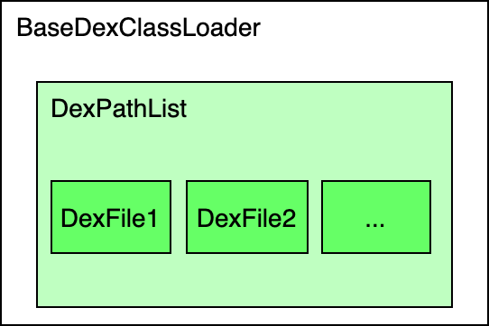
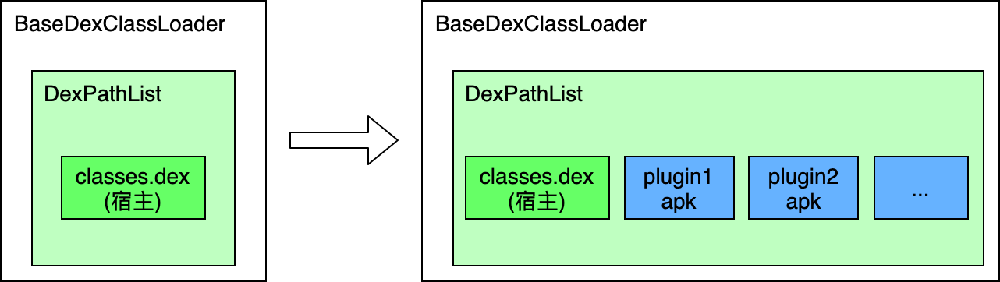
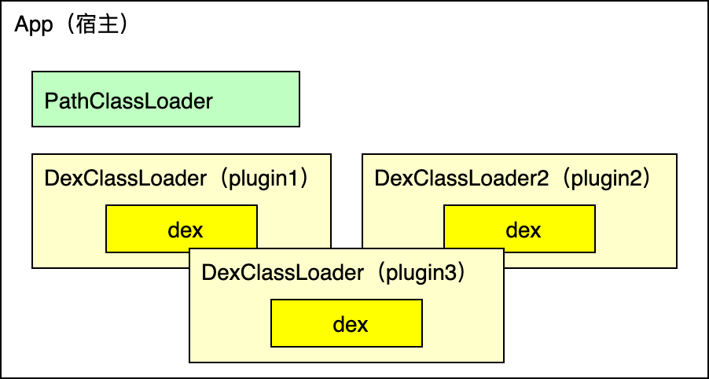
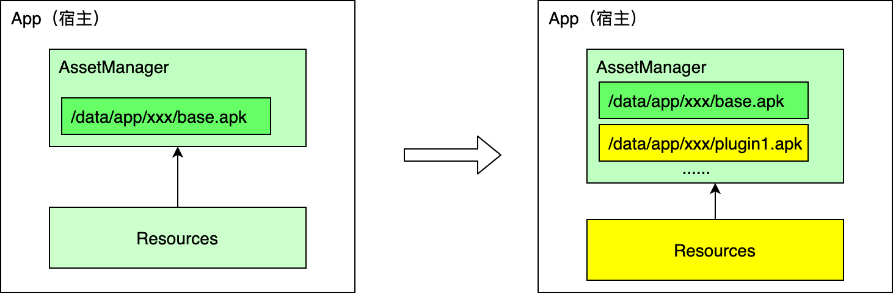
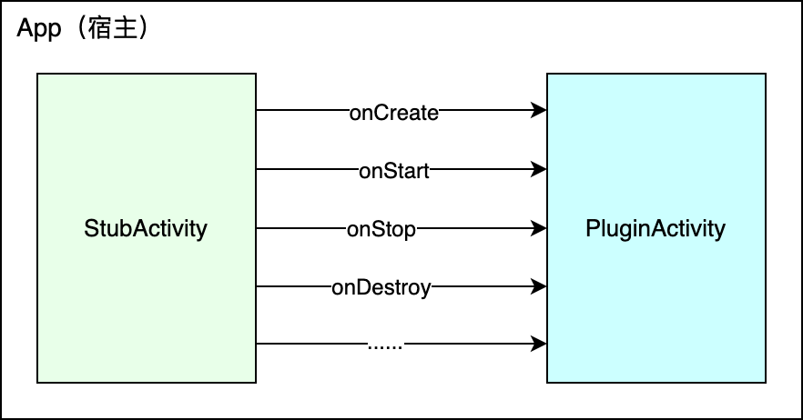
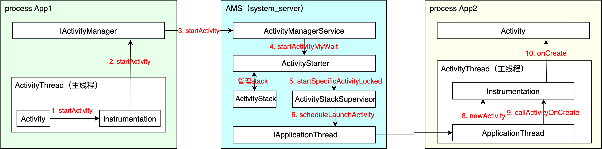
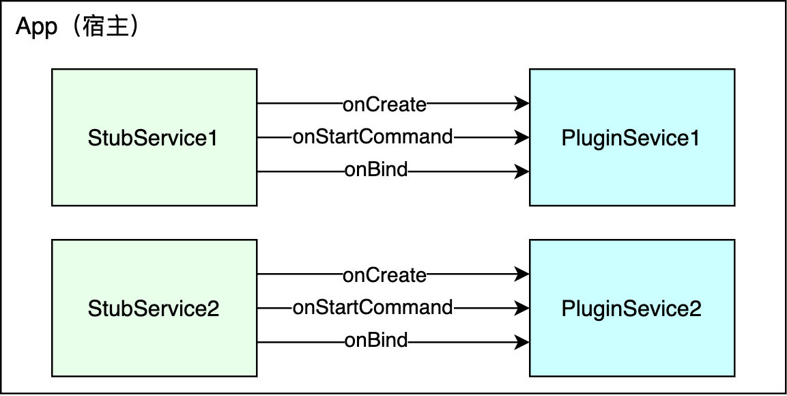
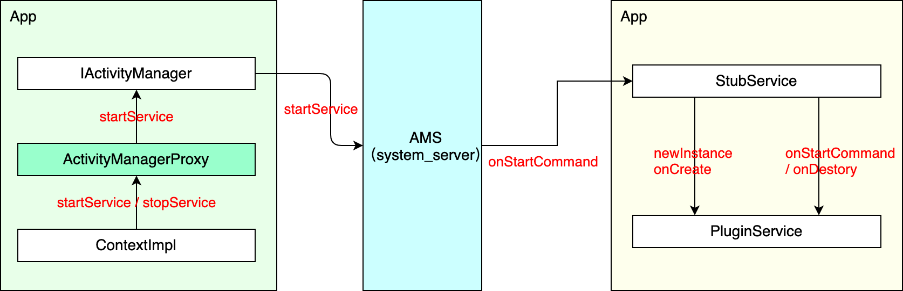

# Android插件化原理解析

# 概述

插件化主要解决的是动态更新、减少包大小等问题，从技术实现层面看需要解决以下3个问题：

1. 插件代码的加载及与宿主代码的通信
2. 插件资源的加载及与宿主资源的共享
3. 四大组件生命周期管理

其中代码只能通过`ClassLoader`进行加载，资源通过`AssetManager`进行加载。本文将分为3个部分简述当前主流插件化方案的基本实现原理，包括：

1. 代码加载
2. 资源加载
3. 四大组件的支持

# 1. 代码加载

自2014年左右各大App遇到方法数超出65536问题后，代码的动态加载就成了Android程序员需要掌握的基本知识，`Android Studio2.0`推出的`Instant Run`机制，更是将动态加载的应用发挥到了极致。因本文重点介绍插件化机制的核心原理，对动态加载技术不做深入探讨，在此仅对双亲委派模型做简单的介绍。

## 1.1 ClassLoader双亲委派模型

所谓`双亲委派模型`，就是先通过`父ClassLoader`去加载类，`父ClassLoader`加载失败再通过自己加载。

```java
protected Class<?> loadClass(String name, boolean resolve)
    throws ClassNotFoundException {
    // 1.检查该类是否已经加载完成
    Class<?> c = findLoadedClass(name);
    if (c == null) {
        try {
            // 2.该类未加载，尝试通过父ClassLoader加载该类
            if (parent != null) {
              	c = parent.loadClass(name, false);
            }
        } catch (ClassNotFoundException e) {
          	// ClassNotFoundException
        }

        // 3.父ClassLoader加载失败，再通过自己加载
        if (c == null) {
          	c = findClass(name);
        }
    }
    return c;
}
```

通过`双亲委派模型`的思想，我们既可以让`宿主`的`ClassLoader`支持加载插件代码，也可以给插件创建一个新的`ClasserLoader`。

## 1.2 BaseDexClassLoader与DexPathList

在Android中有2个`ClassLoader`可以加载apk，分别是`PathClassLoader`和`DexClassLoader`。它们均继承`BaseDexClassLoader`，差别在于`PathClassLoader`的`optimizedDirectory`和`librarySearchPath`参数为空，只能用于系统加载已安装的apk文件，而`DexClassLoader`可以加载任意指定的apk文件。

```java
public class PathClassLoader extends BaseDexClassLoader {
    public PathClassLoader(String dexPath, ClassLoader parent) {
        super(dexPath, null, null, parent);
    }
}

public class DexClassLoader extends BaseDexClassLoader {
    public DexClassLoader(String dexPath, String optimizedDirectory,
            String librarySearchPath, ClassLoader parent) {
        super(dexPath, new File(optimizedDirectory), librarySearchPath, parent);
    }
}
```

`DexClassLoader`中有一个`DexPathList`类型的`pathList`对象，`pathList`是一个dex数组，故可以加载多个dex文件。



`MultiDex`方案解决方法数超65536问题采用的就是此方案，将主dex之外的dex文件注入到`pathList`数组中，以实现加载多dex。这里就引出了插件加载的`单ClassLoader`和`多ClassLoader方案`。

## 1.3 单ClassLoader

所谓`单ClassLoader`，就是把插件的apk路径注入到`pathList`数组中，以实现`PathClassLoader`可以加载插件代码。下面以`MultiDex`的代码为例介绍如何将插件apk路径注入到`pathList`数组中。

```java
private static void install(ClassLoader loader, List<File> additionalClassPathEntries, File optimizedDirectory) {
  	Field pathListField = findField(loader, "pathList");
  	Object dexPathList = pathListField.get(loader);
  	expandFieldArray(dexPathList, "dexElements", makeDexElements(dexPathList, new ArrayList<File>(additionalClassPathEntries), optimizedDirectory, suppressedExceptions)); 
}

private static Object[] makeDexElements(Object dexPathList, ArrayList<File> files, File optimizedDirectory, ArrayList<IOException> suppressedExceptions) {
  	Method makeDexElements = findMethod(dexPathList, "makeDexElements", ArrayList.class, File.class, ArrayList.class);
  	return (Object[]) makeDexElements.invoke(dexPathList, files, optimizedDirectory, suppressedExceptions);
}
```



## 1.4 多ClassLoader

`单ClassLoader方案`的**优势**在于可以实现 `插件之间`、`插件与宿主之间`代码的自由访问，但**缺点**也很明显，*最大的问题是插件之间的代码容易出现冲突，要求宿主、插件之间必须使用同一版本的类库，否则会发现冲突*，如果希望插件之间的业务迭代相对独立，应该采用多`ClassLoader方案`。



`多ClassLoader方案`为每一个插件创建不同的`ClassLoader`，插件之间隔离，不可直接相互访问代码。

```java
private ClassLoader createClassLoader(Context context, String apkPath, String dexOptDir, String nativeDir) {
  	DexClassLoader classLoader = new DexClassLoader(apkPath, dexOptDir, nativeDir, context.getClassLoader()); //context.getClassLoader().getParent()
  	return classLoader;
}
```

在构建插件的`DexClassLoader`时，可根据插件是否需要访问宿主代码，选择传入不同的`parent ClassLoader`。如插件与宿主完全独立，可给`DexClassLoader`构造方法的parent参数传入`BootClassLoader（context.getClassLoader().getParent()）`。

# 2. 资源加载

资源的加载仅有一种方式，即反射调用`AssetManager`的`addAssetPath`方法添加apk路径，再通过`AssetManager`创建`Resources`对象。

```java
AssetManager assetManager = AssetManager.class.newInstance();
Reflector.with(assetManager).method("addAssetPath", String.class).call(apkFile);
```

根据插件与宿主、插件之间是否共享资源，有 **资源共享**和**资源独立** 两种实现方案。

## 2.1 资源共享

资源共享的好处在于插件与宿主、插件之间可以相互访问资源，可减少资源重复。实现的思路为将插件的apk路径添加到`宿主AssetManager`的资源path中，再通过`宿主AssetManager`创建新的`Resources`对象，然后将`宿主ContextImpl和LoadedApk`等处的`Resources`对象替换为新创建的对象。



1. 向宿主`AssetsManager`中添加插件apk路径

```java
Reflector.with(context.getAssets).method("addAssetPath", String.class).call(apkFile);
```

2. 创建新的`Resources`对象

   因部分手机厂商修改了Resources的实现，此处要适配各个厂商，创建相应厂商的Resources对象

```java
return new Resources(assetManager, hostResources.getDisplayMetrics(), hostResources.getConfiguration());
```

3. 替换`宿主ContextImpl`和`LoadedApk`等处的Resources对象

以上步骤因Android版本的差异，实现有所不同，需针对各Android版本的差异进行适配。

### 2.1.1 资源冲突及解决方案

因插件之间独立编译，插件间会出现资源id相同的情况，因共享同一个Resources对象，在访问资源时将出现冲突。目前主流的方案是根据资源id的格式，为每个插件的资源id分配不同的`package id`。

> 资源id是一个32位的整型，格式为PP TT EEEE，分别代码package id、type id、entry id

在aapt的默认配置中，package id 0x01为系统资源，0x7F为普通app资源，其他区段暂未使用。目前有两种主流方案修改`PP`：

1. 修改aapt源码，为每个插件分配不同的package id
2. 编译完成后修改resource.arsc文件，修改资源的resource id

两种方案各有利弊，第一种方案需要适配aapt的版本，第二种方案需要适配`gradle plugin`版本，均需一定的维护成本。所幸自`build tool 28.0.3`起，aapt2支持了设置package id，方便了开发者自定义。

```gr
aaptOptions {
		// 设置0x1~0x7f之间的保留id需指定--allow-reserved-package-id参数
		additionalParameters /*'--allow-reserved-package-id',*/'--package-id','0x8f'
}
```

## 2.2 资源独立

资源共享的方案较适合插件之间需共享资源的场景，如插件之间相对独立，资源没有必要共享，为每一个插件创建不同的AssetManager和Resources对象，自然就不存在资源id冲突的问题了。实现较为简单，在此处不再赘述。

# 3. 四大组件的支持

动态加载完插件代码和资源后，需要赋予插件四大组件生命周期，才能让插件真正的像已安装的App一样运行起来。

首先需要初始化插件的`Application`，核心代码如下：

```java
// 参考LoadedApk#makeApplication()
public Application makeApplication(boolean forceDefaultAppClass, Instrumentation instrumentation) throws Exception {
    String appClass = mPackageInfo.applicationInfo.className;
    if (forceDefaultAppClass || (appClass == null)) {
      appClass = "android.app.Application";
    }
  	// 注：此处mClassLoader为插件ClassLoader，见#1.4 createClassLoader方法
    mApplication = instrumentation.newApplication(mClassLoader, appClass, mPluginContext);
    instrumentation.callApplicationOnCreate(mApplication);
    return mApplication;
}
```

这里需要创建插件的`Context`，在插件Context中，需要重写getClassLoader、getResources等方法，以正确获取插件ClassLoader、Resources等信息，代码示例如下：

```java
public class PluginContext extends ContextWrapper {
    private Plugin mPlugin;
    public PluginContext(Plugin plugin, Context base) {
        super(base);
        this.mPlugin = plugin;
    }
    @Override
    public Context getApplicationContext() { return mPlugin.getApplication(); }
    @Override
    public ContentResolver getContentResolver() 
    {	return new PluginContentResolver(getBaseContext()); }
    @Override
    public ClassLoader getClassLoader() { return mPlugin.getClassLoader(); }
    @Override
    public String getPackageName() { return mPlugin.getPackageName(); }
    @Override
    public PackageManager getPackageManager() { return mPlugin.getPackageManager(); }
    @Override
    public AssetManager getAssets() { return mPlugin.getAssets(); }
    @Override
    public Resources getResources() { return mPlugin.getResources(); }
    @Override
    public Resources.Theme getTheme() { return mPlugin.getTheme(); }
}
```

## 3.1 Activity

在早期的插件化方案中，使用`静态代理`的方式实现插件Activity生命周期的管理，即在宿主中预埋`StubActivity`，在StubActivity中将各生命周期方法转发至插件Activity，代表性的方案是`Dynamic-load-apk`。此方案因没有涉及Framework层的hook，因而兼容性和稳定性极好，但此方案的限制较多，比如插件内使用Context的地方不能直接使用this，而需要使用宿主的Context，对插件的开发约束性较高，且不易迁移到其他的框架中。



为了不侵入插件的开发过程，真正实现无缝加载插件，很多大牛在研究四大组件启动过程源码后，推出了`hook系统服务` + `动态代理` 的方案。即在拦截插件Activity的启动过程，替换为启动宿主StubActivity，待绕过AMS校验，创建Activity实例时再替换回插件Activity，系统只能感知到StubActivity的存在，不知道创建的是插件Activity实例，所有生命方法都回调给插件Activity，让插件Activity真正的拥有了生命周期。此类方案的典型代表是`DroidPlugin`和`VirtualApk`。

想要实现此方案，首先需了解Activity的启动过程，如下图所示：

1. Activity启动方通过调用`Instrumention`的`startActivity`方法，`Instrumention`再通过`IActivityManager`与`AMS`通信；
2. `AMS`做完一系列处理后，调用目标App的`IApplicaionThread`启动目标Activity；
3. 在目标App内部，依然是通过`Instrumentation`进行Activity创建的。



从上图可以看出，`Instrumentation`是App与`AMS`之间启动Activity的桥梁，故可以hook `Instrumentation`进行处理。

```java
private void hookInstrumentation() {
  	// ActivityThread是hide类，此处为减少反射，进行了显式依赖（provided编译）
  	ActivityThread activityThread = ActivityThread.currentActivityThread();
  	Instrumentation originalInstrumentation = activityThread.getInstrumentation();
  	mProxyInstrumentation = new ProxyInstrumentation(this, originalInstrumentation);
  	Reflector.with(activityThread).field("mInstrumentation").set(mProxyInstrumentation);

  	// 为替换插件Activity主题等信息，此hook ActivityThread.mH的消息处理过程
  	Handler mainHandler = Reflector.with(activityThread).method("getHandler").call();
  	Reflector.with(mainHandler).field("mCallback").set(mInstrumentation);
}
```

`ProxyInstrumentation`的实现主要是重写`execStartActivity`和`newActivity`方法，首先看上图中的步骤2（startActivity）：

```java
public class ProxyInstrumentation extends Instrumentation implements Handler.Callback {
  	public ActivityResult execStartActivity(Context who, IBinder contextThread, IBinder token, Activity target, Intent intent, int requestCode, Bundle options) {
      	// 1.解析隐式Intent
  			if (intent == null || intent.getComponent() == null) {
          	// 此处需根据各插件的包信息进行解析匹配，此处省略
            ResolveInfo info = mPluginManager.resolveActivity(intent);
            if (info != null && info.activityInfo != null) {
                component = new ComponentName(info.activityInfo.packageName, info.activityInfo.name);
                intent.setComponent(component);
            }
        } 
      	// 2.将插件class信息缓存至extra中，以在创建Activity时取出，创建相应的插件Activity
      	if (intent.getComponent() != null) {
            intent.putExtra(KEY_TARGET_PACKAGE, intent.getComponent().getPackageName());
            intent.putExtra(KEY_TARGET_ACTIVITY, intent.getComponent().getClassName());
        }
      	// 3.将intent转化为StubActivity（占坑Activity）
      	selectStubActivity(intent);
      
    		// mBase为宿主的原来的Instrumentation
    		return mBase.execStartActivity(who, contextThread, token, target, intent, requestCode, options);
  	}
}
```

在`ProxyInstrumentation`的`execStartActivity`方法中，需要做3件事情：

1. 解析隐式Intent，此处需根据各插件的包信息进行解析匹配；

   包解析代码较多，因本文重点介绍插件化的实现原理，此处省略。

2. 将插件class信息缓存至extra中，以在创建Activity时取出，创建相应的插件Activity；

3. 将intent转化为`StubActivity`，以通过`AMS`的校验

   `StubActivity`需在宿主App的`AndroidManifest.xml`中声明，根据业务需要，可以声明不同启动模式的`StubActivity`，在选择时，根据插件的Activity配置信息进行匹配。

然后进行上图中的步骤8（newActivity），创建Activity：

```java
public Activity newActivity(ClassLoader cl, String className, Intent intent) {
  	String targetPackage = intent.getStringExtra(KEY_TARGET_PACKAGE);
  	String targetActivity = intent.getStringExtra(KEY_TARGET_ACTIVITY);
  	Plugin plugin = mPluginManager.getLoadedPlugin(targetPackage);
  	if (plugin == null) {
    		return mBase.newActivity(cl, className, intent);
  	}

  	// 取出在startActivity中缓存的插件Activity，通过插件的ClassLoader进行创建插件Activity
    Activity activity = mBase.newActivity(plugin.getClassLoader(), targetActivity, intent);
    // 设置intent component为插件
  	intent.setClassName(targetPackage, targetActivity);  
    activity.setIntent(intent);
  	// 替换activity中的mResources为插件Resources
    Reflector.with(activity).field("mResources").set(plugin.getResources());
    return activity;
}
```

接下来是上图中的步骤9（callActivityOnCreate），先看mainHandler的Callback，在Callback中，需处理`LAUNCH_ACTIVITY`消息，该处必须处理的事情为替换`ActivityClientRecord.ActivityInfo`中的插件`applicationInfo`。

```java
public boolean handleMessage(Message msg) {
    if (msg.what == LAUNCH_ACTIVITY) {
        Object r = msg.obj; // ActivityClientRecord r
        Intent intent = Reflector.with(r).field("intent").get();
      	String targetPackage = intent.getStringExtra(KEY_TARGET_PACKAGE);
      	Plugin plugin = mPluginManager.getLoadedPlugin(targetPackage);
      	ActivityInfo activityInfo = Reflector.with(r).field("activityInfo").get();
      	String targetActivity = intent.getStringExtra(KEY_TARGET_ACTIVITY);
      	ActivityInfo pluginActivityInfo = plugin.getActivityInfo(targetActivity);
      	// 替换ActivityClientRecord.ActivityInfo.applicationInfo为插件applicationInfo
 Reflector.with(activityInfo).field("applicationInfo").set(pluginActivityInfo.applicationInfo);
      	int theme = PluginUtil.getTheme(getHostContext(), intent.getComponent());
    		activityInfo.theme = theme; //设置插件Activity主题
    }
    return false;
}

public void callActivityOnCreate(Activity activity, Bundle icicle) {
    Plugin plugin = mPluginManager.getLoadedPlugin(intent.getPackage()));
    if (plugin == null) {
      	return;
    }
  	// 替换插件Activity中的mBase及mApplication对象
		Reflector.with(activity).field("mBase").set(plugin.getPluginContext());
    Reflector.with(activity).field("mApplication").set(plugin.getApplication());
    mBase.callActivityOnCreate(activity, icicle);
}
```

至此，插件Activity的加载过程就完成了，接下来插件Activity的生命周期由`AMS`进行管理，与`StubActivity`无任何区别。

## 3.2 Service

在了解插件Activity的实现后，似乎Service也可以通过类似的方式实现，然而是不可行的，原因在于Service没有类似Activity的栈的概念，同一个Service类只有一个Service实例，如果采用Activity的方式，则需要在宿主`AndroidManifest.xml`中为每一个插件Activity声明一个`StubService`。这对一些Service较少或者插件较少的业务来说也是可以接受的，毕竟Service不可能无限多，相对是可控的，只是每增加一个插件Service，均需在宿主中声明新的StubService，耦合性较高。此实现方式与Activity类似，如下图所示，在此不做过多介绍。



因为Service是单例的，要支持插件Service且固定数量占坑，只能通过`hook AMS`+`动态代理`的方式，即启动`StubService`，在`StubService`中将`startService/onBind`等操作转发至插件Service。要理解这个实现过程，首先需对Service的启动流程有一定的了解，不清楚的同学建议先阅读[Android 8.0 Service源码分析：启动流程及后台限制详解](./service.md)。

首先，需hook `IActivityManager`：

```java
private void hookActivityManager() {
    Singleton<IActivityManager> defaultSingleton;
    if (Build.VERSION.SDK_INT >= Build.VERSION_CODES.O) {
      defaultSingleton = Reflector.clazz(ActivityManager.class).field("IActivityManagerSingleton").get();
    } else {
      defaultSingleton = Reflector.clazz(ActivityManagerNative.class).field("gDefault").get();
    }

    IActivityManager activityManagerProxy = (IActivityManager) Proxy.newProxyInstance(mContext.getClassLoader(), new Class[]{IActivityManager.class}, new ActivityManagerProxy(this, defaultSingleton.get()));
    Reflector.with(defaultSingleton).field("mInstance").set(activityManagerProxy);
    mActivityManager = activityManagerProxy;
}
```

### 3.2.1 startService



在`ActivityManagerProxy`中，需拦截对Serivce的各项操作，以`startService`为例：

```java
public Object invoke(Object proxy, Method method, Object[] args) throws Throwable {
    switch (method.getName()) {
      case "startService":
        // (IApplicationThread caller, Intent service, String resolvedType, ...)
        return startOrStopService((Intent) args[1], method, args, StubService.EXTRA_COMMAND_START_SERVICE);
        // ......
      default:
        break;
    }
    return method.invoke(mActivityManager, args);
}

private Object startOrStopService(Intent target, Method method, Object[] args, int command) {
  	// 解析插件Service info.
    ResolveInfo resolveInfo = mPluginManager.resolveService(target, 0);
    Intent intent = new Intent(mPluginManager.getHostContext(), StubService.class);
    target.setClassName(serviceInfo.packageName, serviceInfo.name);
    intent.putExtra(StubService.EXTRA_TARGET, target);
    intent.putExtra(StubService.EXTRA_COMMAND, command);
    return mPluginManager.getHostContext().startService(intent);
}
```

实际上是把启动插件Service替换为以`start方式`启动`StubService`，下面看`StubService`的实现：

```java
public class StubService extends Service {

    @Override
    public int onStartCommand(Intent intent, int flags, int startId) {
        Intent target = intent.getParcelableExtra(EXTRA_TARGET);
        int command = intent.getIntExtra(EXTRA_COMMAND, 0);
        PluginManager pluginManager = PluginManager.getInstance(this);
        ComponentName component = target.getComponent(); //插件Service component
        Plugin plugin = pluginManager.getLoadedPlugin(component);
        switch (command) {
        case EXTRA_COMMAND_START_SERVICE: //startService
            Service service;
            // 1.1 插件Service已start或bind过，从缓存中获取
            if (pluginManager.getComponentHelper().isServiceRunning(component)) {
              	service = pluginManager.getComponentHelper().getService(component);
            } else {
              	// 1.2 插件Service未启动过，通过插件ClassLoader创建Service实例
                service = (Service) plugin.getClassLoader().loadClass(component.getClassName()).newInstance();
                ActivityThread mainThread = ActivityThread.currentActivityThread();
                IApplicationThread appThread = mainThread.getApplicationThread();
								// 1.3 反射调用Service.attach方法
                Reflector.with(service)
                  .method("attach", Context.class, ActivityThread.class, String.class, IBinder.class, Application.class, Object.class)
                  .call(plugin.getPluginContext(), mainThread, component.getClassName(), appThread.asBinder(), plugin.getApplication(), pluginManager.getActivityManager());
                // 1.4调用Service.onCreate方法
              	service.onCreate();
            }
            // 2.调用插件service.onStartCommand方法
            return service.onStartCommand(target, flags, startId);
        // ......
        default:
           break;
        }

        return super.onStartCommand(intent, flags, startId);
    }
```

### 3.2.2 bindService

`stopService/stopServiceToken/bindService/unbindService`也可以通过以`start方式`启动`StubService`，在`StubService.onStartCommand`中根据命令参数进行转发，但从Android 8.0后，AMS限制了后台启动Service，固通过该方案`bindService`将出现异常。

所以bind插件Service只能以`bind方式`启动`StubService`，我们能做的事情就是在`Service.onBind`中做文章，[Android 8.0 Service源码分析：启动流程及后台限制详解](./service.md)中有一段描述：

> 具体看`ServiceRecord`的`retrieveAppBindingLocked`方法实现：
>
> 从这个方法中可以看出，如果`fileter`不同，即intent数据不同，将返回一个新的`AppBindRecord`对象。再去看`Intent.FilterComparison equals()`的实现，其比较的是Intent的数据。即，同一个app bind同一个Service，如果bind时传递的Intent数据一致，将共享同一个`AppBindRecord`。也就是说，`bindServiceLocked`中认为Service已经连接，需要**满足2个条件：**
>
> 1. Service已启动
>
> 2. 调用`bindServce`时传递的Intent没有被连接过
>
>    即intent数据不一样，会再次触发onBind。
>
> > 这个设计给我们提供了一种新的思路：在一个Service中，可以根据需要为不同的启动参数，提供不同的binder服务，从而使Service内部逻辑更加清晰。

即对于不同的Intent，`Service.onBind`将重新回调，业务侧可根据业务需要返回不同的Binder对象。各个插件Service的名称显然不同，也即启动`StubService`的`Intent数据`不一致，故可通过类似`onStartCommand`的方式bind插件Service。

```java
public IBinder onBind(Intent intent) {
    Intent target = intent.getParcelableExtra(EXTRA_TARGET);
    ComponentName component = target.getComponent();
    PluginManager pluginManager = PluginManager.getInstance(this);
    Plugin plugin = pluginManager.getLoadedPlugin(component);
    // 1. Service已start或bind过，直接回调插件Service.onBind
    if (pluginManager.getComponentHelper().isServiceRunning(target)) {
        Service service = pluginManager.getComponentHelper().getBindService(target);
        return service.onBind(target);
    }
  	// 2.1 插件Service未启动过，通过插件ClassLoader创建Service实例
    Service service = (Service) plugin.getClassLoader().loadClass(component.getClassName()).newInstance();
    ActivityThread mainThread = ActivityThread.currentActivityThread();
    IApplicationThread appThread = mainThread.getApplicationThread();
		// 2.2 反射调用Service.attach方法
    Reflector.with(service)
      .method("attach", Context.class, ActivityThread.class, String.class, IBinder.class, Application.class, Object.class)
      .call(plugin.getPluginContext(), mainThread, component.getClassName(), appThread.asBinder(), plugin.getApplication(), pluginManager.getActivityManager());
    // 2.3 调用Service.onCreate
  	service.onCreate();
  	// 2.4 调用Service.onBind
    return service.onBind(target);
}
```

同样，`unbindService`也可按此方式处理。

## 3.3 BroadcastReceiver

在四大组件的支持中，`BroadcastReceiver`因为没有生命周期，且支持动态注册，其实现是最简单的，把插件中所有静态注册的`BroadcastReceiver`改为**动态注册**即可。

```java
Map<ComponentName, ActivityInfo> receiverInfos = new HashMap<ComponentName, ActivityInfo>();
for (PackageParser.Activity receiver : mPackage.receivers) {
    receiverInfos.put(receiver.getComponentName(), receiver.info);
    // 通过插件ClassLoader创建BroadcastReceiver实例
    BroadcastReceiver br = (BroadcastReceiver) getClassLoader().loadClass(receiver.getComponentName().getClassName()).newInstance();
    for (PackageParser.ActivityIntentInfo intentInfo : receiver.intents) {
      	// 通过宿主Context动态注册
      	mContext.registerReceiver(br, intentInfo);
    }
}
```

因静态注册需在宿主`AndroidManifest.xml`中声明，虽通过`Activity/Service占坑`的方式动态代理亦可实现，但耦合性高且扩展性低，不适合作为通用方案，但如果业务插件实现广播的静态监听，通过宿主代理也是可以的，取决于业务需要。 

## 3.4 ContentProvider

`ContentProvider`的启动过程与Service类似，否也能通过hook IActivityManager实现动态代理呢？理论是可以的，但实际`IActivityManager.getContentProvide`r返回的`ContentProviderHolder`对象中`IContentProvider`成员并未创建，实际创建是在`ActivityThread.installProvider`阶段，App内所有的Provider信息均存储在ActivityThread的`mProviderMap`成员中 ，故可以想办法hook ActivityThread中的`mProviderMap`实例。

```java
private void hookIContentProvider() {
    Map providerMap = Reflector.with(ActivityThread.currentActivityThread()).field("mProviderMap").get();
    Iterator iterator = providerMap.entrySet().iterator();
    while (iterator.hasNext()) {
        Map.Entry entry = (Map.Entry) iterator.next();
        Object key = entry.getKey();
        String authority;
        if (key instanceof String) {
          	authority = (String) key;
        } else {
          	authority = Reflector.with(key).field("authority").get();
        }
      	// 找到StubProvider的ProviderClientRecord
        if (authority.equals(StubProvider.getAuthority(mContext))) {
            IContentProvider rawProvider = Reflector.with(entry.getValue()).field("mProvider").get();
          	// 创建IContentProvider代理StubProvider
            mIContentProvider = (IContentProvider) Proxy.newProxyInstance(mContext.getClassLoader(), new Class[]{ IContentProvider.class }, new IContentProviderProxy(mContext, rawProvider));
            break;
        }
    }
}
```

创建`IContentProvider代理对象`后，需插件在获取`ContentResolver`时能够正确获取到`IContentProvider代理对象`。在前面的`PluginContext`中，我们重写了`getContentResolver`方法，返回了`PluginContentResolver`对象，在`PluginContentResolver`中，需重写`acquireProvider`方法，以返回上面创建的`IContentProvider代理对象`。

```java
public class PluginContentResolver extends ContentResolver {
    private PluginManager mPluginManager;
    private ContentResolver mBase;
  
    public PluginContentResolver(Context context) {
        super(context);
        mPluginManager = PluginManager.getInstance(context);
        mBase = context.getContentResolver();
    }

    public IContentProvider acquireProvider(Context context, String name) {
        if (mPluginManager.resolveContentProvider(name, 0) != null) {
            return mPluginManager.getIContentProvider();
        }
        return mBase.acquireProvider(context, name);
    }
}
```

至此，我们完成了插件IContentProvider对象的代理，接下来就是在`IContentProviderProxy`中修改`插件authority`为`宿主StubProvider的authority`，以通过`StubProvider`实现代理。

```java
public class ContentProviderProxy implements InvocationHandler {
    @Override
    public Object invoke(final Object proxy, final Method method, Object[] args) throws Throwable {
        wrapUri(method, args);
        return method.invoke(mBase, args);
    }

    private void wrapUri(Method method, Object[] args) {
        Uri uri = null;
        int index = 0;
        if (args != null) {
          	// 不同方法Uri参数的位置可能不一样，固此处通过instanceof进行类型判断
            for (int i = 0; i < args.length; i++) {
                if (args[i] instanceof Uri) {
                    uri = (Uri) args[i];
                    index = i;
                    break;
                }
            }
        }
        if (uri == null) {
            return;
        }

        PluginManager pluginManager = PluginManager.getInstance(mContext);
        // 解析插件ProviderInfo
      	ProviderInfo providerInfo = pluginManager.resolveContentProvider(uri.getAuthority(), 0);
        Plugin plugin = pluginManager.getLoadedPlugin(providerInfo.packageName);
      	// 包装Uri，并替换目标方法的Uri参数
      	args[index] = wrapUri(plugin, uri);
    }
  
    private static Uri wrapUri(Plugin plugin, Uri uri) {
      	// authority设置为host
        StringBuilder sb = new StringBuilder("content://com.host.app.authority");
      	// 将插件包名、路径、原始Uri置于参数中，以便在StubProvider中解析
        sb.append("/?key_plugin=").append(plugin.getFilePath())
                .append("&key_pkg=").append(plugin.getPackageName())
                .append("&key_uri=").append(Uri.encode(uri.toString()));
        return Uri.parse(sb.toString());
    }
}
```

到这一步完成了 `查询插件Provider` -> `StubProvider`，接下来要做的事情是在StubProvider的`query/insert/update/delete`等方法中，从Uri参数中取出插件原始Uri，派发至相应插件的Provider中执行即可。

> 注：示例代码中没有包含ContentProvider.call方法的处理，因call方法不含Uri参数，可在PluginContentResolver中重写call方法，将待访问的Uri注入到bundle参数中，以便StubProvider中取出插件原始Uri。

# 4. 总结与展望

至此，插件化技术实现要解决的三个问题（代码加载、资源加载、四大组件支持）均已分析，当前各主流插件化方案在功能支持上有所差异，但技术思想整体上均为如上所述，只不过有的方案hook底层代码较多，有的hook较少。在实际应用时可灵活综合应用各方案，如同时支持资源共享和资源独立。

> 注：本文重点介绍插件化实现原理，考虑到代码篇幅问题，删减了代码中部分参数校验及异常处理代码。

插件化确实可以解决动态更新、减少包体积等问题，但随着Android版本的更新，系统API逐渐发生变化，对系统层代码的hook和反射修改可能遇到一些兼容性问题，实际上每个Android大版本升级，各个方案或多或少都需要做一些适配，加上各大手机厂商对Framework进行优化和定制，插件化框架的兼容性维护成本不可忽视。自Android 9.0以来，google逐渐加强了对系统层hide方法的访问限制，hook系的方案似乎终究会遇到瓶颈，虽然目前有很多方法可以绕过这个限制，但从长期看google是不希望这些系统层方法被滥用的。

近年来，插件化框架已成为了各大App的基础设施，技术已趋过成熟，近两年一些超级App已趋向容器化的架构发展，ReactNative、小程序、Flutter等跨平台框架的广泛应用，已经将移动端的技术发展推向了新的领域。