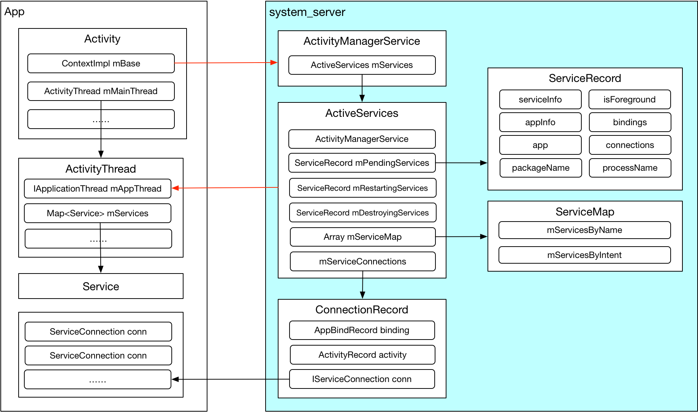
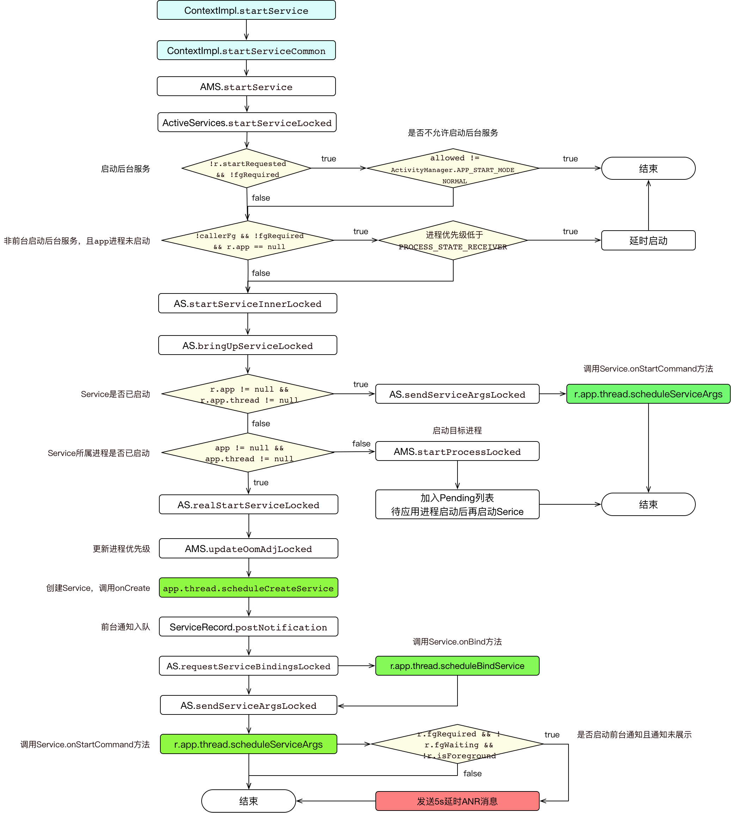
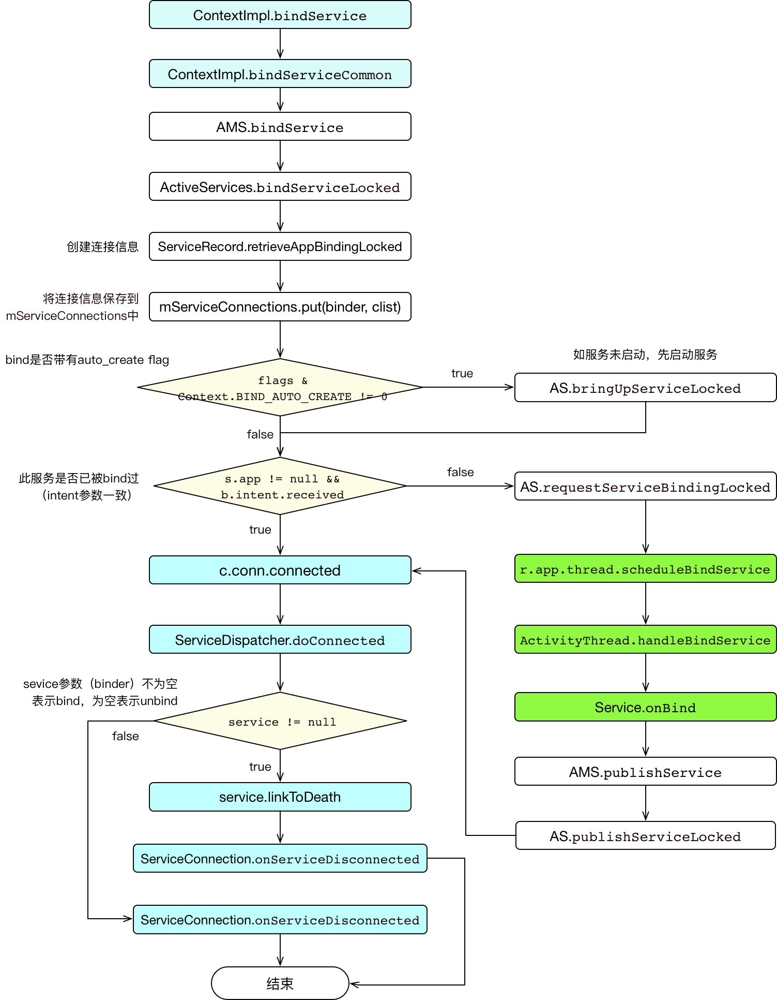
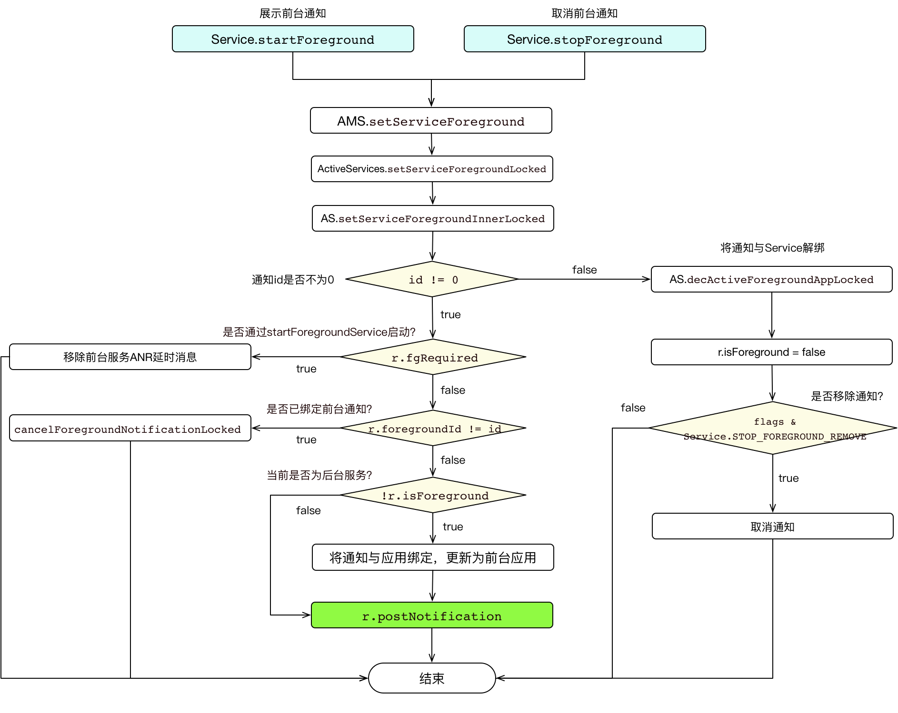
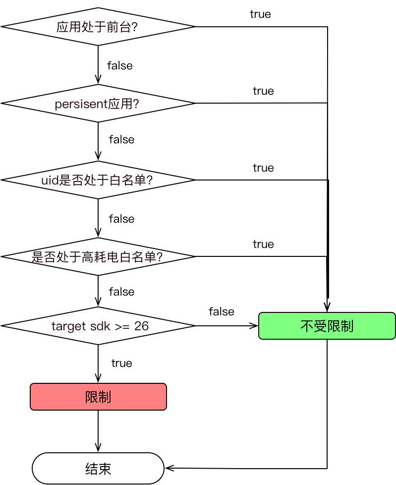
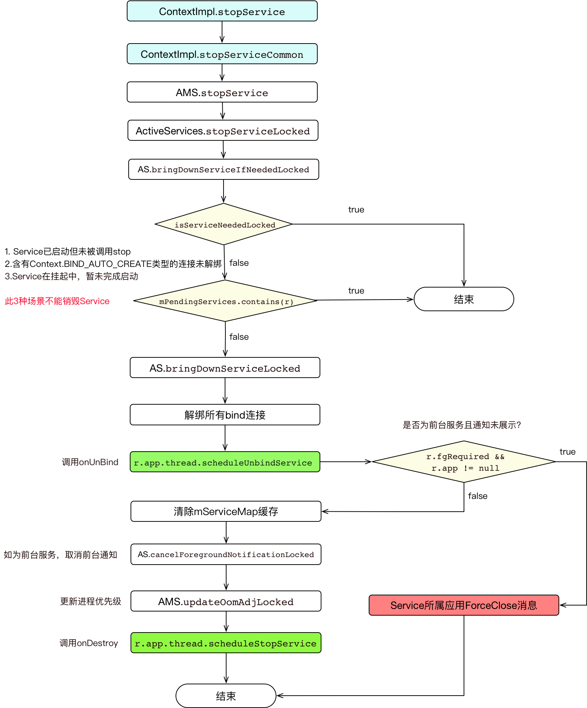
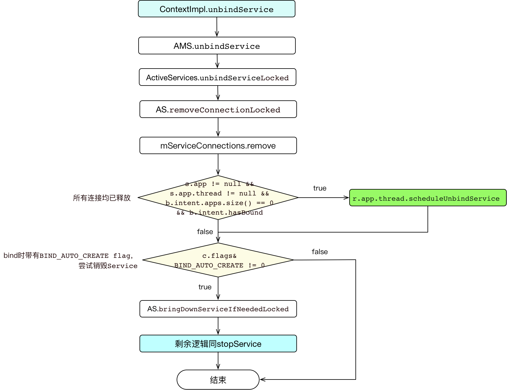
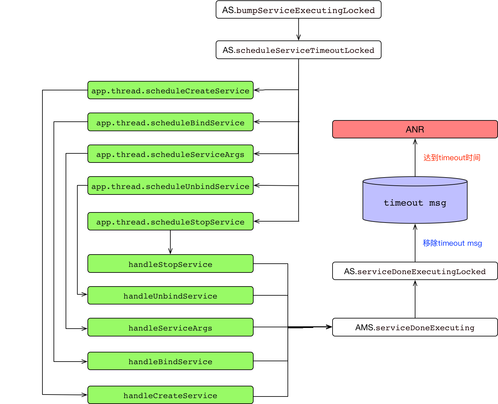

# Android 8.0 Service源码分析：启动流程及后台限制详解

# 概述

一直以来都想把App的启动过程和四大组件的启动过程系统的梳理一 遍，但一直都没有沉下心去阅读源码。因为最近要把一个App的targetSdkVersion升级到26（Android 8.0），需要弄清楚Android 8.0对后台服务究竟做了哪些限制。借此契机把Service的启动流程和后台限制相关的源码梳理了一遍。

在使用Service的过程中，相信不少人有过这些疑问：

* Service的启动流程是怎样的？两种启动方式具体有什么区别？
* Android 8.0+对后台Service究竟做了什么限制？对所有App一视同仁吗？
* 前台服务为什么不受限制？前台服务可以不弹前台通知吗？
* JobService的机制是什么，为什么不受后台限制？

通过阅读本文，了解清楚Service内部机制，你将能够弄明白这些问题。因涉及到篇幅问题，我将分为两篇文章来介绍Service。

**本篇重点介绍：**

1. 先整体介绍与Service交互过程中涉及到的几个角色，以及它们各自承担的职责；
2. 从源码层面讲解Service的启动过程，包括start和bind两种方式，如何启动前台服务，以及后台启动的限制；
3. 再从源码层面讲解Service的销毁过程，包括stop和unbind两种方式，以及Service被stop的几种场景、进程状态、ANR机制等；
4. 最后进行总结，回答上面提出的几个问题。

每一个小节过后都会梳理出流程图，下一篇将介绍JobService机制。

# 1. Service整体交互结构 

Service作为Android四大组件之一，其生命周期是通过`system_server `进程中的ActivityManagerService（AMS）管理的，所以要理解Service的通信机制，首先要了解Binder机制，对Binder不了解的同学请先阅读[关于Binder，作为应用开发者你需要知道的全部](./binder.md)，本篇不做过多介绍。

下面先上一张图，大致了解Service通信过程中涉及到的几个主要角色。



**App端进程：**

* **ContextImpl**

  Context抽象类所有api的实现，是Service、Activity和其他组件base Context。

* **ActivityThread**

  代表着App的主线程，是App的入口，Application、Activity、Service都在ActivityThread中创建，维护着该App所有运行中的Service实例。其中有一个IApplicationThread类型成员mAppThread，用于被AMS跨进程调用。

* **Service**
  具体提供服务的Service，被ActivityThread管理。

* **ServiceConnection**

  监听Service连接状态的接口，用于bindService。

**AMS端：**

* **ActivityManagerService**

  四大组件的大管家，是Framework中极为重要的一个类。

* **ActiveServices**

  AMS中管理Service的具体类。

* **ServiceRecord**

  Service结构的具体描述。

* **ServiceMap**

  描述了一个用户（App）的所有Service记录，主要用于检索。

* **ConnectionRecord**

  Client端与Service端绑定的抽象描述。

# 2. Service启动过程

## 2.1 startService

首先看入口：

[frameworks/base/core/java/android/app/ContextImpl.java](http://androidxref.com/8.1.0_r33/xref/frameworks/base/core/java/android/app/ContextImpl.java)

```java
@Override
public ComponentName startService(Intent service) {
    warnIfCallingFromSystemProcess();
    return startServiceCommon(service, false, mUser);
}

private ComponentName startServiceCommon(Intent service, boolean requireForeground, UserHandle user) {
    validateServiceIntent(service);
    service.prepareToLeaveProcess(this);
    ComponentName cn = ActivityManager.getService().startService(mMainThread.getApplicationThread(), service, service.resolveTypeIfNeeded(getContentResolver()), requireForeground, getOpPackageName(), user.getIdentifier());
    ......
	return cn;
}
```

ContextImpl中只做了`validateServiceIntent`校验（target 21之后限制隐式启动），然后调用了`AMS`的`startService`方法。再看`AMS`中的实现：

[frameworks/base/services/core/java/com/android/server/am/ActivityManagerService.java](http://androidxref.com/8.1.0_r33/xref/frameworks/base/services/core/java/com/android/server/am/ActivityManagerService.java)

```java
@Override
public ComponentName startService(IApplicationThread caller, Intent service, String resolvedType, boolean requireForeground, String callingPackage, int userId)
    throws TransactionTooLargeException {
    ......
    synchronized(this) {
        final int callingPid = Binder.getCallingPid();
        final int callingUid = Binder.getCallingUid();
        final long origId = Binder.clearCallingIdentity();
        ComponentName res;
        try {
            res = mServices.startServiceLocked(caller, service, resolvedType, callingPid, callingUid, requireForeground, callingPackage, userId);
        } finally {
            Binder.restoreCallingIdentity(origId);
        }
        return res;
    }
}
```

直接调用了`ActiveServices `的`startServiceLocked`方法。

[frameworks/base/services/core/java/com/android/server/am/ActiveServices.java](http://androidxref.com/8.1.0_r33/xref/frameworks/base/services/core/java/com/android/server/am/ActiveServices.java)

```java
ComponentName startServiceLocked(IApplicationThread caller, Intent service, String resolvedType, int callingPid, int callingUid, boolean fgRequired, String callingPackage, final int userId)
    throws TransactionTooLargeException {
    ......
    // 1. 从mServiceMap中查询SerivceRecord缓存，如果没有则创建一个
    ServiceLookupResult res = retrieveServiceLocked(service, resolvedType, callingPackage, callingPid, callingUid, userId, true, callerFg, false);
    ......
    ServiceRecord r = res.record;
    ......
    // If this isn't a direct-to-foreground start, check our ability to kick off an arbitrary service
    // fgRequired为false，即不是启动前台服务
    if (!r.startRequested && !fgRequired) {
        // 2. 检查是否允许启动方应用启动Service
        final int allowed = mAm.getAppStartModeLocked(r.appInfo.uid, r.packageName, r.appInfo.targetSdkVersion, callingPid, false, false);
        // app mode不为APP_START_MODE_NORMAL表示应用处于后台，而不在后台不受限的白名单中
        if (allowed != ActivityManager.APP_START_MODE_NORMAL) {
            Slog.w(TAG, "Background start not allowed: service " + service + " to " + r.name.flattenToShortString() + " from pid=" + callingPid + " uid=" + callingUid + " pkg=" + callingPackage);
            // 不允许启动后台Service
            return new ComponentName("?", "app is in background uid " + uidRec);
        }
    }
	......
    r.startRequested = true;
    ......
    final ServiceMap smap = getServiceMapLocked(r.userId);
    boolean addToStarting = false;
    // 3. 非前台调用，且非启动前台服务，且app进程未启动
    if (!callerFg && !fgRequired && r.app == null && mAm.mUserController.hasStartedUserState(r.userId)) {
        ProcessRecord proc = mAm.getProcessRecordLocked(r.processName, r.appInfo.uid, false);
        if (proc == null || proc.curProcState > ActivityManager.PROCESS_STATE_RECEIVER) {
            // 如果调用方进程不在前台，而且正在启动的后台Service过多，该Service会被延时启动，避免在短时间内启动大量进程。
            if (smap.mStartingBackground.size() >= mMaxStartingBackground) {
                smap.mDelayedStartList.add(r);
                r.delayed = true;
                return r.name;
            }
            addToStarting = true;
        }
        ......
    } 
    ......

    ComponentName cmp = startServiceInnerLocked(smap, service, r, callerFg, addToStarting);
    return cmp;
}
```

这个方法中做了几个检查操作：

1. 从`mServiceMap`中查询`SerivceRecord`缓存，如果没有则创建一个；
2. 如果不是启动前台服务，会检查启动方是否能启动Service，如果启动方应用不在前台，且未在允许后台启动Service的白名单中，将禁止启动。（*白名单的逻辑在后面介绍*）
3. 如非前台调用，也非启动前台服务，且app进程未启动，且正在启动的后台Service过多，该Service会被延时启动，避免在短时间内启动大量进程。
4. 通过了前面的检查，调用`startServiceInnerLocked`

```java
ComponentName startServiceInnerLocked(ServiceMap smap, Intent service, ServiceRecord r, boolean callerFg, boolean addToStarting) throws TransactionTooLargeException {
    ......
    // 调用bringUpServiceLocked启动Service
    String error = bringUpServiceLocked(r, service.getFlags(), callerFg, false, false);
    ......
    return r.name;
}
```

`startServiceInnerLocked`调用`bringUpSrviceLocked`启动Service。

```java
private String bringUpServiceLocked(ServiceRecord r, int intentFlags, boolean execInFg, boolean whileRestarting, boolean permissionsReviewRequired)
    throws TransactionTooLargeException {
    // 1.如果此Service已经被启动，直接调用onStartCommand
    if (r.app != null && r.app.thread != null) {
        sendServiceArgsLocked(r, execInFg, false);
        return null;
    }
	......
    if (!isolated) {
        app = mAm.getProcessRecordLocked(procName, r.appInfo.uid, false);
        // 2.Service所属进程已经启动
        if (app != null && app.thread != null) {
            try {
                app.addPackage(r.appInfo.packageName, r.appInfo.versionCode, mAm.mProcessStats);
                // 进入真正启动Service流程
                realStartServiceLocked(r, app, execInFg);
                return null;
            } catch (TransactionTooLargeException e) {
                throw e;
            } catch (RemoteException e) {
                Slog.w(TAG, "Exception when starting service " + r.shortName, e);
            }
        }
    }

    // 3.如果Service所属进程尚未启动，则先启动进程
    if (app == null && !permissionsReviewRequired) {
        if ((app=mAm.startProcessLocked(procName, r.appInfo, true, intentFlags, hostingType, r.name, false, isolated, false)) == null) {
            bringDownServiceLocked(r);
            return msg;
        }
    }
    // 加入Pengding列表
    if (!mPendingServices.contains(r)) {
        mPendingServices.add(r);
    }
	......
    return null;
}
```

这个方法做了3件事情：

1. 如果此Service已经被启动，直接调用`onStartCommand`；
2. 如果此Service未启动，但所属进程已启动，则调用`realStartServiceLocked`进入真正启动Service的流程；
3. 如果Service所属进程尚未启动，则先启动进程，如app进程启动失败则销毁此Service；如启动成功，则加入Pengding启动列表，待App进程启动结束后再启动Service。

下面看真正启动Service的方法`realStartServiceLocked`：

```java
private final void realStartServiceLocked(ServiceRecord r, ProcessRecord app, boolean execInFg) throws RemoteException {
    .....
    final boolean newService = app.services.add(r);
    bumpServiceExecutingLocked(r, execInFg, "create");
    mAm.updateLruProcessLocked(app, false, null);
    updateServiceForegroundLocked(r.app, /* oomAdj= */ false);
    // 1.调整应用进程优先级
    mAm.updateOomAdjLocked();

    boolean created = false;
    try {
        ......
        mAm.notifyPackageUse(r.serviceInfo.packageName, PackageManager.NOTIFY_PACKAGE_USE_SERVICE);       app.forceProcessStateUpTo(ActivityManager.PROCESS_STATE_SERVICE);
        // 2.通知ActivityThread创建Service，调用onCreate
        app.thread.scheduleCreateService(r, r.serviceInfo, mAm.compatibilityInfoForPackageLocked(r.serviceInfo.applicationInfo), app.repProcState);
        // 3.如果已经设置通知，创建前台通知
        r.postNotification();
        created = true;
    }
    ......

    // 通知ActivityThread调用Service的onBind方法
    requestServiceBindingsLocked(r, execInFg);
    updateServiceClientActivitiesLocked(app, null, true);
    // 1.如启动前台服务，则发送一个5s的延时消息，如5s内未调用Service.startForeground，应用将ANR
    // 2.通知ActivityThread调用Service的onStartCommand方法
    sendServiceArgsLocked(r, execInFg, true);
	......
}
```

1. 通知`AMS`调整应用进程优先级

2. 跨进程调用，通过Service所属进程的`IApplicationThread`，即ActivityThread创建Service实例，再调用其onCreate方法；

3. 如果已经设置通知，则创建前台通知；

4. 如果Service已经被绑定，则调用`onBind`方法；

5. 调用`sendServiceArgsLocked`

   这个方法主要做了2个事情：

   1）如启动前台服务，则发送一个5s的延时消息，如5s内未调用`Service.startForeground`，应用将ANR；

   2）通知ActivityThread调用Service的`onStartCommand`方法；

> 大家对第3、4步可能会有一个疑问：Service刚创建，肯定没有调用`startForeground`设置前台通知，也没有被bind，为什么要检查是否创建前台通知、调用onBind呢？

在前一个方法`bringUpServiceLocked`中我们已经介绍，当应用进程未启动时，`AMS`首先是去启动Service所属进程，同时`ServiceRecord`放进了Pengding列表。在应用主线线被创建后，再启动之前被挂起的Service，所以是存在已经设置前台通知或者被bind的情况的。

> 本篇重点介绍Service的启动流程，Pengding Service被启动的逻辑不做详细介绍，调用过程如下，有兴趣的同学可以查阅源码。
> 1. ActivityThread.attach
> 2. AMS.attachApplication
> 3. AMS.attachApplicationLocked
> 4. ActiveServices.attachApplicationLocked
> 5. ActiveServices.realStartServiceLocked

### 流程图：start



## 2.2 bindService

下面看`bindService`的流程，入口同样在`ContextImpl`中。

[frameworks/base/core/java/android/app/ContextImpl.java](http://androidxref.com/8.1.0_r33/xref/frameworks/base/core/java/android/app/ContextImpl.java)

```java
public boolean bindService(Intent service, ServiceConnection conn, int flags) {
    warnIfCallingFromSystemProcess();
    return bindServiceCommon(service, conn, flags, mMainThread.getHandler(), Process.myUserHandle());
}

private boolean bindServiceCommon(Intent service, ServiceConnection conn, int flags, Handler handler, UserHandle user) {
    IServiceConnection sd = mPackageInfo.getServiceDispatcher(conn, getOuterContext(), handler, flags);
    validateServiceIntent(service);
    int res = ActivityManager.getService().bindService(
        mMainThread.getApplicationThread(), getActivityToken(), service, service.resolveTypeIfNeeded(getContentResolver()), sd, flags, getOpPackageName(), user.getIdentifier());
    return res != 0;
}
```

类似`startService`，`bindService`也是经由`bindServiceCommon`交由`AMS`处理。要注意的是bind连接回调`ServiceConnection`是引用类型，需要先将其转换为bind接口`IServiceConnection`才能进行跨进程传递。

[frameworks/base/services/core/java/com/android/server/am/ActivityManagerService.java](http://androidxref.com/8.1.0_r33/xref/frameworks/base/services/core/java/com/android/server/am/ActivityManagerService.java)

```java
public int bindService(IApplicationThread caller, IBinder token, Intent service, String resolvedType, IServiceConnection connection, int flags, String callingPackage, int userId) throws TransactionTooLargeException {
    ......
    synchronized(this) {
        return mServices.bindServiceLocked(caller, token, service, resolvedType, connection, flags, callingPackage, userId);
    }
}
```

`AMS`中同样直接交给了`ActiveService`处理。

[frameworks/base/services/core/java/com/android/server/am/ActiveServices.java](http://androidxref.com/8.1.0_r33/xref/frameworks/base/services/core/java/com/android/server/am/ActiveServices.java)

```java
int bindServiceLocked(IApplicationThread caller, IBinder token, Intent service, String resolvedType, final IServiceConnection connection, int flags, String callingPackage, final int userId) throws TransactionTooLargeException {
    .....
    // 1.从ServiceMap中查找ServiceRecord，在这里进行了exported属性、权限等校验。
    ServiceLookupResult res = retrieveServiceLocked(service, resolvedType, callingPackage, Binder.getCallingPid(), Binder.getCallingUid(), userId, true, callerFg, isBindExternal);
    ServiceRecord s = res.record;
    ......

    try {
        // 2.将Service调用方和被调用方的信息保存到AMS中
        mAm.startAssociationLocked(callerApp.uid, callerApp.processName, callerApp.curProcState, s.appInfo.uid, s.name, s.processName);
        
        // 3.创建连接信息
        AppBindRecord b = s.retrieveAppBindingLocked(service, callerApp);
        ConnectionRecord c = new ConnectionRecord(b, activity, connection, flags, clientLabel, clientIntent);

        IBinder binder = connection.asBinder();
        ArrayList<ConnectionRecord> clist = s.connections.get(binder);
        if (clist == null) {
            clist = new ArrayList<ConnectionRecord>();
            s.connections.put(binder, clist);
        }
        clist.add(c);
        b.connections.add(c);
        if (activity != null) {
            if (activity.connections == null) {
                activity.connections = new HashSet<ConnectionRecord>();
            }
            activity.connections.add(c);
        }
        b.client.connections.add(c);
        if ((c.flags&Context.BIND_ABOVE_CLIENT) != 0) {
            b.client.hasAboveClient = true;
        }
        if ((c.flags&Context.BIND_ALLOW_WHITELIST_MANAGEMENT) != 0) {
            s.whitelistManager = true;
        }
        if (s.app != null) {
            updateServiceClientActivitiesLocked(s.app, c, true);
        }
        clist = mServiceConnections.get(binder);
        // 4.将连接信息保存到mServiceConnections中
        if (clist == null) {
            clist = new ArrayList<ConnectionRecord>();
            mServiceConnections.put(binder, clist);
        }
        clist.add(c);

        // 5.如flag包含BIND_AUTO_CREATE，先启动Service
        if ((flags&Context.BIND_AUTO_CREATE) != 0) {
            s.lastActivity = SystemClock.uptimeMillis();
            if (bringUpServiceLocked(s, service.getFlags(), callerFg, false, permissionsReviewRequired) != null) {
                return 0;
            }
        }

        if (s.app != null && b.intent.received) {
            // 6.如Service已启动或者此intent未被连接过，立即发布连接，回调onServiceConnected
            c.conn.connected(s.name, b.intent.binder, false);
        } else if (!b.intent.requested) {
            // 7.Service未被bind过，先调用onBind，再回调onServiceConnected
            requestServiceBindingLocked(s, b.intent, callerFg, false);
        }
    } finally {
        Binder.restoreCallingIdentity(origId);
    }

    return 1;
}
```

这个方法的处理步骤如下：

1. 从ServiceMap中查找ServiceRecord；

   并且在查的时进行了exported属性、权限等校验。

2. 将Service调用方和被调用方的信息保存到AMS中；

3. 创建连接信息；

4. 将连接信息保存到`mServiceConnections`中；

5. 如bind的flag包含`BIND_AUTO_CREATE`，则先尝试启动Service；

6. 如此intent未被连接过，直接建立连接，回调onServiceConnected；

7. Service未被bind过，需先调用onBind后，再回调onServiceConnected。

> 连接的过程分为2种场景：已经bind过 和 未被bind过，这2种场景如何区分呢？

`s.app != null && b.intent.received`，回到前面创建`AppBindRecord`的代码：

```java
// 3.创建连接信息
AppBindRecord b = s.retrieveAppBindingLocked(service, callerApp);
ConnectionRecord c = new ConnectionRecord(b, activity, connection, flags, clientLabel, clientIntent);
```

具体看`ServiceRecord`的`retrieveAppBindingLocked`方法实现：

```java
public AppBindRecord retrieveAppBindingLocked(Intent intent, ProcessRecord app) {
    Intent.FilterComparison filter = new Intent.FilterComparison(intent);
    // bindings是一个map
    IntentBindRecord i = bindings.get(filter);
    if (i == null) {
        i = new IntentBindRecord(this, filter);
        bindings.put(filter, i);
    }
    AppBindRecord a = i.apps.get(app);
    if (a != null) {
        return a;
    }
    a = new AppBindRecord(this, i, app);
    i.apps.put(app, a);
    return a;
}
```

从这个方法中可以看出，如果`fileter`不同，即intent数据不同，将返回一个新的`AppBindRecord`对象。再去看`Intent.FilterComparison equals()`的实现，其比较的是Intent的数据。即，同一个app bind同一个Service，如果bind时传递的Intent数据一致，将共享同一个`AppBindRecord`。也就是说，`bindServiceLocked`中认为Service已经连接，需要**满足2个条件：**

1. Service已启动

2. 调用`bindServce`时传递的Intent没有被连接过

   即intent数据不一样，会再次触发onBind。

> 这个设计给我们提供了一种新的思路：在一个Service中，可以根据需要为不同的启动参数，提供不同的binder服务，从而使Service内部逻辑更加清晰。

继续看bind的过程：

```java
private final boolean requestServiceBindingLocked(ServiceRecord r, IntentBindRecord i, boolean execInFg, boolean rebind) throws TransactionTooLargeException {
    if ((!i.requested || rebind) && i.apps.size() > 0) {
        bumpServiceExecutingLocked(r, execInFg, "bind");
      r.app.forceProcessStateUpTo(ActivityManager.PROCESS_STATE_SERVICE);
        r.app.thread.scheduleBindService(r, i.intent.getIntent(), rebind, r.app.repProcState);
        if (!rebind) {
            i.requested = true;
        }
        i.hasBound = true;
        i.doRebind = false;
    }
    return true;
}
```

调用`ActivityThread`进行bind，这里不关注`ActivityThread`内部消息派发过程，直接看bind的实现。

[frameworks/base/core/java/android/app/ActivityThread.java](http://androidxref.com/8.1.0_r33/xref/frameworks/base/core/java/android/app/ActivityThread.java)

```java
private void handleBindService(BindServiceData data) {
    Service s = mServices.get(data.token);
          data.intent.setExtrasClassLoader(s.getClassLoader());
    data.intent.prepareToEnterProcess();
    if (!data.rebind) {
        IBinder binder = s.onBind(data.intent);
        ActivityManager.getService().publishService(
            data.token, data.intent, binder);
    } else {
        s.onRebind(data.intent);
        ActivityManager.getService().serviceDoneExecuting(
            data.token, SERVICE_DONE_EXECUTING_ANON, 0, 0);
    }
    ensureJitEnabled();
	......
}
```

调用`Service.onBind`后，继续调用`AMS.publishService`发布Service。

```java
public void publishService(IBinder token, Intent intent, IBinder service) {
    mServices.publishServiceLocked((ServiceRecord)token, intent, service);
}
```

继续看`ActiveServices.publishServiceLocked`。

```java
void publishServiceLocked(ServiceRecord r, Intent intent, IBinder service) {
    final long origId = Binder.clearCallingIdentity();
    Intent.FilterComparison filter = new Intent.FilterComparison(intent);
    IntentBindRecord b = r.bindings.get(filter);
    if (b != null && !b.received) {
        // 1.将IntentBindRecord.binder赋值为onBinder返回的Binder对象
        b.binder = service;
        b.requested = true;
        // 2.将IntentBindRecord.binder置为true，表示已调用onBind
        b.received = true;
        // 3.遍历此Service的所有连接记录
        for (int conni=r.connections.size()-1; conni>=0; conni--) {
            ArrayList<ConnectionRecord> clist = r.connections.valueAt(conni);
            for (int i=0; i<clist.size(); i++) {
                ConnectionRecord c = clist.get(i);
                if (!filter.equals(c.binding.intent.intent)) {
                    continue;
                }
                // 找到匹配的intent进行连接
                c.conn.connected(r.name, service, false);
            }
        }
    }
    serviceDoneExecutingLocked(r, mDestroyingServices.contains(r), false);
}
```

publish过程主要做了3件事：

1. 将IntentBindRecord.binder赋值为`Service.onBinder`返回的Binder对象；

2. 将IntentBindRecord.binder置为true，表示已调用onBind；

   这一步骤后，其他client再通过相同的intent数据进行bind，将直接进行连接，不会再进行onBind的过程。

3. 遍历此Service的所有连接记录，找到匹配的intent进行连接。

接下看connect的具体过程：

在前面`ContextImp.bindServiceCommon`中已经知道，传递到`AMS`中的`ServiceConnection`是经过包装的`IServiceConnection`Binder对象，所以`connect`的过程实际上是在**启动方进程**中进行的。此`IServiceConnection`是`LoadedApk`的静态内部类`InnerConnection`。

```java
private static class InnerConnection extends IServiceConnection.Stub {
    final WeakReference<LoadedApk.ServiceDispatcher> mDispatcher;

    InnerConnection(LoadedApk.ServiceDispatcher sd) {
        mDispatcher = new WeakReference<LoadedApk.ServiceDispatcher>(sd);
    }

    public void connected(ComponentName name, IBinder service, boolean dead)
        throws RemoteException {
        LoadedApk.ServiceDispatcher sd = mDispatcher.get();
        if (sd != null) {
            sd.connected(name, service, dead);
        }
    }
}
```

`InnerConnection`直接将连接的处理逻辑交给了`ServiceDispatcher`。

```java
static final class ServiceDispatcher {
    public void connected(ComponentName name, IBinder service, boolean dead) {
        if (mActivityThread != null) {
            mActivityThread.post(new RunConnection(name, service, 0, dead));
        } else {
            doConnected(name, service, dead);
        }
    }
    
    public void doConnected(ComponentName name, IBinder service, boolean dead) {
        ServiceDispatcher.ConnectionInfo old;
        ServiceDispatcher.ConnectionInfo info;

        synchronized (this) {
            // 已经unbind，不做处理
            if (mForgotten) {
                return;
            }
            // old不为null，表示此ServiceConnection进行了其他连接
            old = mActiveConnections.get(name);
            // 同一个Connection已进行过连接，不做处理
            if (old != null && old.binder == service) {
                return;
            }

            // IBinder对象不为null，表示建立新连接
            if (service != null) {
                info = new ConnectionInfo();
                info.binder = service;
                info.deathMonitor = new DeathMonitor(name, service);
                try {
                    // linkToDeath
                    service.linkToDeath(info.deathMonitor, 0);
                    // 保存连接信息
                    mActiveConnections.put(name, info);
                } catch (RemoteException e) {
                    mActiveConnections.remove(name);
                    return;
                }
            } else {
                // IBinder对象为null，表示断开连接
                mActiveConnections.remove(name);
            }

            if (old != null) {
                old.binder.unlinkToDeath(old.deathMonitor, 0);
            }
        }

        // 先移除旧连接
        if (old != null) {
            mConnection.onServiceDisconnected(name);
        }
        if (dead) {
            mConnection.onBindingDied(name);
        }
        // 新连接，回调onServiceConnected
        if (service != null) {
            mConnection.onServiceConnected(name, service);
        }
    }
    
    private final class DeathMonitor implements IBinder.DeathRecipient {
        DeathMonitor(ComponentName name, IBinder service) {
            mName = name;
            mService = service;
        }
        public void binderDied() {
            death(mName, mService);
        }
        final ComponentName mName;
        final IBinder mService;
    }
    
    public void doDeath(ComponentName name, IBinder service) {
        synchronized (this) {
            ConnectionInfo old = mActiveConnections.get(name);
            if (old == null || old.binder != service) {
                return;
            }
            // 移除ConnectionInfo
            mActiveConnections.remove(name);
            // 调用unlinkToDeath
            old.binder.unlinkToDeath(old.deathMonitor, 0);
        }
        // 调用ServiceConnection.onServiceDisconnected
        mConnection.onServiceDisconnected(name);
    }
}
```

`ServiceDispatcher.connected`继续调用`doConnected`，`doConnected`中做了以下几件事情：

1. 判断是否为重复bind，如是则直接return；

2. 如IBinder对象不为null，表示新建连接，保存连接信息，`linkToDeath`；为null，表示断开连接；

   `linkToDeath`的目的是在Service被异常kill后，移除连接信息，并且回调`ServiceConnection.onServiceDisconnected`。

3. 如此`ServiceConnection`已进行了其他连接，则先断开原有连接；

   此场景出现在：

   1）unbindService，具体过程下面分析；

   2）用同一个`ServiceConnection`去bind同一个Service，`onBind`触发了多次的情况，即bind时intent参数有变化。

4. 新连接建立完成，回调`ServiceConnection.onServiceConnected`

   至此，一次bind连接已经完成，之后启动方就可以通过连接成功后返回的IBinder对象与Service进行交互了。

### 流程图：bind

一次bind连接的完整流程如下：



## 2.3 启动前台服务

在前面分析startService流程时我们已经知道，应用处于后台时不允许直接启动后台服务，接下来看启动`前台服务`的流程。

[frameworks/base/core/java/android/app/ContextImpl.java](http://androidxref.com/8.1.0_r33/xref/frameworks/base/core/java/android/app/ContextImpl.java)

```java
public ComponentName startForegroundService(Intent service) {
    warnIfCallingFromSystemProcess();
    return startServiceCommon(service, true, mUser);
}
```
启动前台服务需调用`startForegroundService`，和`startService`一样都是调用`AMS.startService`方法，不同之处在于其传递的`requireForeground`参数为`true`，表示启动`前台服务`。其处理过程的**不同之处在于：**

1. 不受启动后台服务的限制，即应用处于后台仍可调用；
2. 在`realStartServiceLocked`真正启动Service后，会发送一个延时`5s`的消息，Service必须要`5s`内调用`startForeground`展示一个前台通知，否则Service所属应用将发生ANR。

实际上如启动Service时应用处于前台，可直接startService，待应用切换到后台后再调用`startForeground`切换到前台服务。下面看`startForeground`的处理过程：

[frameworks/base/core/java/android/app/Service.java](http://androidxref.com/8.1.0_r33/xref/frameworks/base/core/java/android/app/Service.java)


```java
public final void startForeground(int id, Notification notification) {
    try {
        mActivityManager.setServiceForeground(new ComponentName(this, mClassName), mToken, id, notification, 0);
    } catch (RemoteException ex) {
    }
}
```
和`startService`一样，调用`AMS`方法。

[frameworks/base/services/core/java/com/android/server/am/ActivityManagerService.java](http://androidxref.com/8.1.0_r33/xref/frameworks/base/services/core/java/com/android/server/am/ActivityManagerService.java)

```java
public void setServiceForeground(ComponentName className, IBinder token, int id, Notification notification, int flags) {
    synchronized(this) {
        mServices.setServiceForegroundLocked(className, token, id, notification, flags);
    }
}
```
`AMS`调用`ActiveServices.setServiceForegroundInnerLocked`方法。

[frameworks/base/services/core/java/com/android/server/am/ActiveServices.java](http://androidxref.com/8.1.0_r33/xref/frameworks/base/services/core/java/com/android/server/am/ActiveServices.java)

```java
private void setServiceForegroundInnerLocked(ServiceRecord r, int id, Notification notification, int flags) {
    // 1.如通知id不为0
    if (id != 0) {
        if (notification == null) {
            throw new IllegalArgumentException("null notification");
        }
        // Instant apps need permission to create foreground services.
        ......
        // 2.如是以前台服务方式启动的，移除ANR延时消息
        if (r.fgRequired) {
            r.fgRequired = false;
            r.fgWaiting = false;
                      mAm.mHandler.removeMessages(ActivityManagerService.SERVICE_FOREGROUND_TIMEOUT_MSG, r);
        }
        // 3.先取消已经绑定的通知
        if (r.foregroundId != id) {
            cancelForegroundNotificationLocked(r);
            r.foregroundId = id;
        }
        notification.flags |= Notification.FLAG_FOREGROUND_SERVICE;
        r.foregroundNoti = notification;
        // 4.如Service当前为非前台服务，更新Service状态
        if (!r.isForeground) {
            final ServiceMap smap = getServiceMapLocked(r.userId);
            if (smap != null) {
                ActiveForegroundApp active = smap.mActiveForegroundApps.get(r.packageName);
                if (active == null) {
                    active = new ActiveForegroundApp();
                    active.mPackageName = r.packageName;
                    active.mUid = r.appInfo.uid;
                    active.mShownWhileScreenOn = mScreenOn;
                    if (r.app != null) {
                        active.mAppOnTop = active.mShownWhileTop = r.app.uidRecord.curProcState <= ActivityManager.PROCESS_STATE_TOP;
                    }
                    active.mStartTime = active.mStartVisibleTime = SystemClock.elapsedRealtime();
smap.mActiveForegroundApps.put(r.packageName, active);
                    // 将通知与应用绑定，更新为前台应用
requestUpdateActiveForegroundAppsLocked(smap, 0);
                }
                active.mNumActive++;
            }
            r.isForeground = true;
        }
        // 5.加入通知展示队列
        r.postNotification();
        if (r.app != null) {
            updateServiceForegroundLocked(r.app, true);
        }
        getServiceMapLocked(r.userId).ensureNotStartingBackgroundLocked(r);
        mAm.notifyPackageUse(r.serviceInfo.packageName, PackageManager.NOTIFY_PACKAGE_USE_FOREGROUND_SERVICE);
    } else {
        // 通知id为0，与原有前台通知解绑，如flag为true则取消前台通知(即stopForeground(true))
        ......
    }
}
```

该方法做了以下5件事件：

1. 如果通知id为0，相当于调用`stopForeground`方法，将原有通知与Serivce解绑，移除前台通知；
2. id不为0，如果是通过`startForegroundService`方式启动，则先移除在start时设置的ANR延时消息；
3. 取消已经绑定的通知，更新前台通知id；
4. 如果Service当前为非前台服务，则将通知与应用绑定，更新为前台应用；
5. 将前台通知加入通知展示队列。

### 流程图：展示/取消前台通知



## 2.4 后台启动限制

前台介绍startService过程时我们知道，对于启动后台服务，会调用`AMS.getAppStartModeLocked`判断其`startMode`，如不为`ActivityManager.APP_START_MODE_NORMAL`，将被禁止启动。下面看这个方法是怎么决定`startMode`的。

[frameworks/base/services/core/java/com/android/server/am/ActivityManagerService.java](http://androidxref.com/8.1.0_r33/xref/frameworks/base/services/core/java/com/android/server/am/ActivityManagerService.java)

```java
int getAppStartModeLocked(int uid, String packageName, int packageTargetSdk, int callingPid, boolean alwaysRestrict, boolean disabledOnly) {
    UidRecord uidRec = mActiveUids.get(uid);
    // uidRec.idle表示应用处于后台
    if (uidRec == null || alwaysRestrict || uidRec.idle) {
        if (ephemeral) {
            return ActivityManager.APP_START_MODE_DISABLED;
        } else {
            if (disabledOnly) {
                return ActivityManager.APP_START_MODE_NORMAL;
            }
            final int startMode = (alwaysRestrict) ? appRestrictedInBackgroundLocked(uid, packageName, packageTargetSdk) : appServicesRestrictedInBackgroundLocked(uid, packageName, packageTargetSdk);
            ......
            return startMode;
        }
    }
    // 前台应用直接返回APP_START_MODE_NORMAL
    return ActivityManager.APP_START_MODE_NORMAL;
}
```
这个方法主要做了**1个判断：**

1. ` uidRec.idle`为false，即应用在前台。

   返回`ActivityManager.APP_START_MODE_NORMAL`，即前台应用不限制启动后台Service；

2. ` uidRec.idle`为true，即应用在后台

   如`alwaysRestrict`为true，则判断app在后台是否受限制；如为false，则判断Service在后台是否受限制。

`ActiveServices.bringUpSrviceLocked`中调用`AMS.getAppStartModeLocked`时传递的`alwaysRestrict`为false，所以看`appServicesRestrictedInBackgroundLocked`的实现。

```java
int appServicesRestrictedInBackgroundLocked(int uid, String packageName, int packageTargetSdk) {
    // 1. Persistent app不受限制
    if (mPackageManagerInt.isPackagePersistent(packageName)) {
        return ActivityManager.APP_START_MODE_NORMAL;
    }
    // 2. uid处于后台白名单中的用户不受限制
    if (uidOnBackgroundWhitelist(uid)) {
        return ActivityManager.APP_START_MODE_NORMAL;
    }
    // 3. 处于耗电白名单的应用不受限制
    if (isOnDeviceIdleWhitelistLocked(uid)) {
        return ActivityManager.APP_START_MODE_NORMAL;
    }

    // 4. 以上条件均不满足，再检查app的后台限制条件
    return appRestrictedInBackgroundLocked(uid, packageName, packageTargetSdk);
}
```
`appServicesRestrictedInBackgroundLocked`中做了**3个判断：**

1. `persistent`应用不受限制；

2. 处于后台白名单中的`uid`不受限制

   此白名单中只有一个uid：`BLUETOOTH_UID`，即蓝牙应用`com.android.bluetooth `；

   > 注：uid为`system`的应用可以调用`AMS.backgroundWhitelistUid`将某一应用加入到此白名单中。

3. 处于耗电白名单的应用不受限制

   此白名单定义在`/data/system/deviceidle.xml`文件中，由电量管理Service`DeviceIdleController `管理，此Service启动时会从此文件中读取配置。同样，此名单可被动态添加，在开发时，我们可以通过命令将应用添加到耗电白名单中：

   ```shell
   adb shell dumpsys deviceidle whitelist +package_name
   ```

如以上条件均不满足，继续调用`appRestrictedInBackgroundLocked`方法。这个方法逻辑很简单，`target>=26`的应用均受限制。

```java
int appRestrictedInBackgroundLocked(int uid, String packageName, int packageTargetSdk) {
    // target O(26)+的应用均后台限制
    if (packageTargetSdk >= Build.VERSION_CODES.O) {
        return ActivityManager.APP_START_MODE_DELAYED_RIGID;
    }
    ......
}
```

### 流程图：后台start限制场景



# 3. Service销毁过程

上面讲解了Service的启动过程，下面来分析Service的停止过程，先来看stopService。

## 3.1 stopService

和startService一样，入口在ContextImpl中，经过AMS最终派发到ActiveServices中处理。

[frameworks/base/services/core/java/com/android/server/am/ActiveServices.java](http://androidxref.com/8.1.0_r33/xref/frameworks/base/services/core/java/com/android/server/am/ActiveServices.java)

```java
int stopServiceLocked(IApplicationThread caller, Intent service, String resolvedType, int userId) {
    // 查找Service
    ServiceLookupResult r = retrieveServiceLocked(service, resolvedType, null, Binder.getCallingPid(), Binder.getCallingUid(), userId, false, false, false);
    ......
    stopServiceLocked(r.record);
    ......
    return 0;
}

private void stopServiceLocked(ServiceRecord service) {
    ......
    // 将service.startRequested置为false
    service.startRequested = false;
    ......
    bringDownServiceIfNeededLocked(service, false, false);
}
```

`stopServiceLocked`中首先从ServiceMap中查询Service记录，将`service.startRequested`置为`false`，然后调用了`bringDownServiceIfNeededLocked`方法。

```java
private final void bringDownServiceIfNeededLocked(ServiceRecord r, boolean knowConn, boolean hasConn) {
    // 有些例外的场景，Service暂时不能被stop
    if (isServiceNeededLocked(r, knowConn, hasConn)) {
        return;
    }
    // Service还在挂起中，并未完成启动
    if (mPendingServices.contains(r)) {
        return;
    }
    bringDownServiceLocked(r);
}


private final boolean isServiceNeededLocked(ServiceRecord r, boolean knowConn, boolean hasConn) {
    // Service已启动但未被调用stop
    if (r.startRequested) {
        return true;
    }
    // 有Context.BIND_AUTO_CREATE类型的连接未解绑
    if (!knowConn) {
        hasConn = r.hasAutoCreateConnections();
    }
    if (hasConn) {
        return true;
    }
    return false;
}
```
`bringDownServiceIfNeededLocked`中先调用`isServiceNeededLocked`判断了Service还是否需要，如果需要，不能被stop。

### 销毁Service需满足的3个条件

`isServiceNeededLocked`判断逻辑为：

1. Service已启动但未被调用stop；
2. Service含有`Context.BIND_AUTO_CREATE`类型的连接未解绑；
3. 除此之外，因为所属进程暂未启动而被挂起的Service同样不能被stop。

如不属于此3种情况，调用`bringDownServiceLocked`完成stop操作。

```java
private final void bringDownServiceLocked(ServiceRecord r) {
    // 1.解绑所有bind连接
    for (int conni=r.connections.size()-1; conni>=0; conni--) {
        ......
        cr.conn.connected(r.name, null, true);
    }

    // Tell the service that it has been unbound.
    if (r.app != null && r.app.thread != null) {
        for (int i=r.bindings.size()-1; i>=0; i--) {
            ......
            // 2.通知ActivityThread调用Service的onUnbind方法
            r.app.thread.scheduleUnbindService(r, ibr.intent.getIntent());
        }
    }

    // 3.如果启动的是前台服务，且stop时仍未展示通知，service所属应用将force close。r.fgRequired在展示前台通知后设置为false。
    if (r.fgRequired) {
        if (r.app != null) {
            Message msg = mAm.mHandler.obtainMessage(ActivityManagerService.SERVICE_FOREGROUND_CRASH_MSG);
            msg.obj = r.app;
            mAm.mHandler.sendMessage(msg);
        }
    }
    
    .....
    // 4.清除ServiceMap缓存
    final ServiceMap smap = getServiceMapLocked(r.userId);
    ServiceRecord found = smap.mServicesByName.remove(r.name);
    smap.mServicesByIntent.remove(r.intent);
    r.totalRestartCount = 0;
    unscheduleServiceRestartLocked(r, 0, true);
    
	......
    // 5.取消前台通知(如果此通知未绑定到其它前台服务)
    cancelForegroundNotificationLocked(r);
    if (r.isForeground) {
        decActiveForegroundAppLocked(smap, r);
    }
    
    ......
    // 6.更新进程优先级，通知ActivityThread调用Service的onDestroy
    mAm.updateOomAdjLocked(r.app, true);
    r.app.thread.scheduleStopService(r);
    ......
}
```
`bringDownServiceLocked`中完成了以下清理工作：

1. 解绑所有bind连接；

2. 通知ActivityThread调用Service的onUnbind方法；

3. 如果启动的是前台服务，且stop时仍未展示通知，service所属应用将force close；

4. 清除ServiceMap缓存

5. 取消前台服务通知

6. 更新进程优先级，通知ActivityThread调用Service的onDestroy方法。
  
### 流程图：stop



## 3.2. unBindService

继续看unBindService的过程，首先调用`LoadApk.forgetServiceDispatcher`，在此方法将`ServiceDispatcher`的`mForgotten`成员置为true，表示连接已被unbind，后续收到新的连接不应在继续派发，在前面分析bindService时我们已经介绍。

[frameworks/base/core/java/android/app/ContextImpl.java](http://androidxref.com/8.1.0_r33/xref/frameworks/base/core/java/android/app/ContextImpl.java)

```java
public void unbindService(ServiceConnection conn) {
    IServiceConnection sd = mPackageInfo.forgetServiceDispatcher(getOuterContext(), conn);
    ActivityManager.getService().unbindService(sd);
}
```

继续看`ActiveServices.unbindServiceLocked`。

[frameworks/base/services/core/java/com/android/server/am/ActiveServices.java](http://androidxref.com/8.1.0_r33/xref/frameworks/base/services/core/java/com/android/server/am/ActiveServices.java)

```java
boolean unbindServiceLocked(IServiceConnection connection) {
    IBinder binder = connection.asBinder();
    ArrayList<ConnectionRecord> clist = mServiceConnections.get(binder);
    try {
        while (clist.size() > 0) {
            ConnectionRecord r = clist.get(0);
            //调用removeConnectionLocked移除连接
            removeConnectionLocked(r, null, null);
        }
        // 更新进程优先级
        mAm.updateOomAdjLocked();
    } finally {
        Binder.restoreCallingIdentity(origId);
    }
    return true;
}
```
`unbindServiceLocked`中查询此Connection的连接记录，依次调用`removeConnectionLocked`移除连接。

```java
void removeConnectionLocked(ConnectionRecord c, ProcessRecord skipApp, ActivityRecord skipAct) {
    //移除连接记录
    IBinder binder = c.conn.asBinder();
    AppBindRecord b = c.binding;
    ServiceRecord s = b.service;
    ArrayList<ConnectionRecord> clist = s.connections.get(binder);
    clist = mServiceConnections.get(binder);
    if (clist != null) {
        clist.remove(c);
        if (clist.size() == 0) {
            mServiceConnections.remove(binder);
        }
    }

    //移除AMS中保存的连接信息
    mAm.stopAssociationLocked(b.client.uid, b.client.processName, s.appInfo.uid, s.name);
    if (b.connections.size() == 0) {
        b.intent.apps.remove(b.client);
    }

    if (!c.serviceDead) {
        // 如果该Service已经没有了任何连接，通知Service调用onUnbind
        if (s.app != null && s.app.thread != null && b.intent.apps.size() == 0 && b.intent.hasBound) {
            try {
                b.intent.hasBound = false;
                b.intent.doRebind = false;
                s.app.thread.scheduleUnbindService(s, b.intent.intent.getIntent());
            } catch (Exception e) {
                serviceProcessGoneLocked(s);
            }
        }

        // If unbound while waiting to start, remove the pending service
        mPendingServices.remove(s);
		// 如果bind时flag为BIND_AUTO_CREATE，尝试销毁Service
        if ((c.flags&Context.BIND_AUTO_CREATE) != 0) {
            boolean hasAutoCreate = s.hasAutoCreateConnections();
            bringDownServiceIfNeededLocked(s, true, hasAutoCreate);
        }
    }
}
```

`removeConnectionLocked`做了几件事情：

1. 移除`mServiceConnections`中的连接记录；

2. 移除AMS中保存的连接信息；

3. 如果该Service已经没有了任何连接，调用onUnbind；

4. 如果此连接bind时flag含有BIND_AUTO_CREATE，则尝试销毁Service。

   `bringDownServiceIfNeededLocked`的逻辑在前面介绍`stopService`时已经介绍过。

### 流程图：unbind



## 3.3 stopSelf

[frameworks/base/core/java/android/app/ContextImpl.java](http://androidxref.com/8.1.0_r33/xref/frameworks/base/core/java/android/app/ContextImpl.java)

```java
public final void stopSelf(int startId) {
    mActivityManager.stopServiceToken(new ComponentName(this, mClassName), mToken, startId);
}
```

[frameworks/base/services/core/java/com/android/server/am/ActiveServices.java](http://androidxref.com/8.1.0_r33/xref/frameworks/base/services/core/java/com/android/server/am/ActiveServices.java)

```java
boolean stopServiceTokenLocked(ComponentName className, IBinder token, int startId) {
    ServiceRecord r = findServiceLocked(className, token, UserHandle.getCallingUserId());
    if (r != null) {
        if (startId >= 0) {
            ......
            // 如果调用的是stopSelfResult，则比较传入的startId是否为最近一次回调onStartCommand的startId
            if (r.getLastStartId() != startId) {
                return false;
            }
        }

        ......
        // 以下过程和stop/unbind一致
        bringDownServiceIfNeededLocked(r, false, false);
        Binder.restoreCallingIdentity(origId);
        return true;
    }
    return false;
}
```

stopSelf与stopService流程类似，这里不做重复介绍。

### 流程图：stop/unbind

因stopService、stopSelf和unbindService在`bringDownServiceIfNeededLocked`之后的流程一致，这里把3个流程合并到一张流程图中，方便对比。

上部左侧为stopService流程，上部中间为stopSelf流程，上部右侧为unbind流程，下部公共流程。不同的是，unbind仅在当前连接带有`Context.BIND_AUTO_CREATE`flag时才会调用`bringDownServiceIfNeededLocked`。即只有unbind带有`Context.BIND_AUTO_CREATE`flag的连接才可能销毁Service。


## 3.4 其它stop场景

除了以上3种主动调用api进行stop外，还存在一些其他需要销毁Service的场景：

1. 应用进程死亡后清除其Service；
2. Activity destroy之后清除此Activity的bind连接；
3. 应用退到后台后Service被stop（`target >= 26`）
4. adb命令stop

后台3种场景销毁Service均需满足前面讲的`销毁Service需满足的3个条件`。下面继续分析场景3。

## 3.5 退到后台后Service被stop

官网在[Android 8.0后台执行限制](https://developer.android.com/about/versions/oreo/background)中有这样的介绍：当app切换到后台后，应用在几分种内仍然允许创建和使用后台Service，超过这个时间才被认为是闲置状态。

> When an app goes into the background, it has a window of several minutes in which it is still allowed to create and use services. At the end of that window, the app is considered to be *idle*. 

这个`几分钟内`究竟是几分钟？继续看代码。`AMS`中有一个`updateOomAdjLocked`方法，主要作用是更新进程状态和调整进程优先级。这个方法的调用场景非常多：

* Activity创建、销毁、前台后切换；
* Service创建、销毁、前台服务创建
* 接收到广播等等；

同样，当应用切换到后台时，同样会调用这个方法，下面来看看其具体实现。

[frameworks/base/services/core/java/com/android/server/am/ActivityManagerService.java](http://androidxref.com/8.1.0_r33/xref/frameworks/base/services/core/java/com/android/server/am/ActivityManagerService.java)

```java
final void updateOomAdjLocked() {
    ......
    // 遍历所有uid
    for (int i=mActiveUids.size()-1; i>=0; i--) {
        final UidRecord uidRec = mActiveUids.valueAt(i);
        int uidChange = UidRecord.CHANGE_PROCSTATE;
        if (uidRec.setProcState != uidRec.curProcState || uidRec.setWhitelist != uidRec.curWhitelist) {
            if (ActivityManager.isProcStateBackground(uidRec.curProcState) && !uidRec.curWhitelist) {
                // 进程当前处于后台，上一次状态为前台，且不处于白名单中
                if (!ActivityManager.isProcStateBackground(uidRec.setProcState) || uidRec.setWhitelist) {
                    // 将lastBackgroundTime设置为当前时间
                    uidRec.lastBackgroundTime = nowElapsed;
                    // 发出一个延时消息
                    if (!mHandler.hasMessages(IDLE_UIDS_MSG)) {                  mHandler.sendEmptyMessageDelayed(IDLE_UIDS_MSG, mConstants.BACKGROUND_SETTLE_TIME);
                                                              }
                }
            } else {
                // 进程当前不处于后台，如idle状态已为true，将idle置为false，同时将lasBackgroundTime置为0。
                if (uidRec.idle) {
                    uidChange = UidRecord.CHANGE_ACTIVE;
                    EventLogTags.writeAmUidActive(uidRec.uid);
                    uidRec.idle = false;
                }
                uidRec.lastBackgroundTime = 0;
            }
        }
    }
    ......
}
```
这个方法很长，我们截取关键部分进行分析：遍历所有有进程存活的uid，如果进程当前处于后台，且上一次状态为前台，**且不在白名单中**（*此白名单暂时未弄清楚*），将lastBackgroundTime设置为当前时间（即表示应用最近一次切换到后台的时间点），然后发出一个延时`mConstants.BACKGROUND_SETTLE_TIME`的消息，具体时间为`60s`。即此消息一分钟后发出，由`idleUids`进行处理。

`ActivityManager.isProcStateBackground`的判断逻辑是：

```java
public static final boolean isProcStateBackground(int procState) {
    return procState >= PROCESS_STATE_TRANSIENT_BACKGROUND;
}
```

即：

* procState >= `PROCESS_STATE_TRANSIENT_BACKGROUND`（8）为处于后台；
* procState < 8为处于前台

后台服务的procState为11，前台服务为4。当应用切换到后台，且只有后台服务在运行时，将被定义为处于`idle`状态。

```java
final void idleUids() {
    synchronized (this) {
        ......
        final long nowElapsed = SystemClock.elapsedRealtime();
        // maxBgTime值为当前时间减60s
        final long maxBgTime = nowElapsed - mConstants.BACKGROUND_SETTLE_TIME;
        ......
        // 遍历所有uid
        for (int i=N-1; i>=0; i--) {
            final UidRecord uidRec = mActiveUids.valueAt(i);
            final long bgTime = uidRec.lastBackgroundTime;
            if (bgTime > 0 && !uidRec.idle) {
                // 如果应用最近一次切换到后台的时间点 < maxBgTime
                // 即lastBackgroundTime + 60s <= maxBgTime
                // 即应用处于后台达到了60s
                if (bgTime <= maxBgTime) {
                    EventLogTags.writeAmUidIdle(uidRec.uid);
                    // 将uid状态置为空闲
                    uidRec.idle = true;
                    doStopUidLocked(uidRec.uid, uidRec);
                } 
                ......
            }
        }
    }
}
```
`idleUids`中同样遍历所有uid，如果有应用处于后台的时间达到了`60s`，应用状态将被置为`idle`，然后调用`doStopUidLocked`方法。

```java
final void doStopUidLocked(int uid, final UidRecord uidRec) {
    mServices.stopInBackgroundLocked(uid);
    enqueueUidChangeLocked(uidRec, uid, UidRecord.CHANGE_IDLE);
}
```
`doStopUidLocked`中直接调用了`ActiveSevices.stopInBackgroundLocked`。

[frameworks/base/services/core/java/com/android/server/am/ActiveServices.java](http://androidxref.com/8.1.0_r33/xref/frameworks/base/services/core/java/com/android/server/am/ActiveServices.java)

```java
void stopInBackgroundLocked(int uid) {
    // 查询此uid的所有Service
    ServiceMap services = mServiceMap.get(UserHandle.getUserId(uid));
    ArrayList<ServiceRecord> stopping = null;
    if (services != null) {
        for (int i=services.mServicesByName.size()-1; i>=0; i--) {
            ServiceRecord service = services.mServicesByName.valueAt(i);
            if (service.appInfo.uid == uid && service.startRequested) {
                // 如应用当前不处于APP_START_MODE_NORMAL，所有Service都加入stop列表
                if (mAm.getAppStartModeLocked(service.appInfo.uid, service.packageName, service.appInfo.targetSdkVersion, -1, false, false) != ActivityManager.APP_START_MODE_NORMAL) {
                    if (stopping == null) {
                        stopping = new ArrayList<>();
                    }
                    stopping.add(service);
                }
            }
        }
        if (stopping != null) {
            // 遍历stop所有Service
            for (int i=stopping.size()-1; i>=0; i--) {
                ServiceRecord service = stopping.get(i);
                service.delayed = false;
               services.ensureNotStartingBackgroundLocked(service);
                // stop service，流程与调用stopService一致
                stopServiceLocked(service);
            }
        }
    }
}
```

查询此uid的所有Service，如应用的`startMode`当前不处于`APP_START_MODE_NORMAL`，所有Service都加入stop列表，`startMode`的判断逻辑前面在分析`后台启动限制`时已详细分析。后台遍历此stop列表，依次调用`stopServiceLocked`进行stop，`stopServiceLocked`的流程与`stopSerivce`一致，不在重复介绍。

> 注：`uidRec.curWhitelist`为临时白名单，我暂时没有弄清楚此白名单的设置过程，但认为此白名单必要性不大。因为：`updateOomAdjLocked`中是遍历所有uid，只要有uid满足条件均会触发`60s`的延时消息，而此消息的处理方法`idleUids`并没有再次判断白名单，只要处于后台达到了60s的应用都会进入`stopInBackgroundLocked`流程，此临时白名单并无实际意义。
>
> 有理解此逻辑的同学请指正。

## 3.6 进程idle状态

前面在分析startService和后台限制过程时，可以发现Service中“前后台”的定义与应用前后台切换中的“后台”定义不同。Service中定义应用是否处于后台取决于`idle`状态：

* `idle`为`true`表示处于后台；
* `idle`为`false`表示处于前台。

> 前台已经分析过，后台服务的procState为11，前台服务为4。当应用切换到后台，且只有后台服务在运行时，60s后将被定义为处于`idle`状态。

**改变进程idle状态的有三处：**

1. procState **>=** `PROCESS_STATE_TRANSIENT_BACKGROUND（8）`

   `updateOomAdjLocked()`中发出`60s`延时消息，在`idleUids()`中置为`true`。

2. procState **<** `PROCESS_STATE_TRANSIENT_BACKGROUND（8）`

   `updateOomAdjLocked()`中置为`false`，详见前面的分析。

3. 另一个是通过shell命令主动将进程置为`idle`状态

   ```shell
   adb shell am make-uid-idle package_name
   
   可过滤如下log查看
   adb logcat | grep "Idling uid
   W ActivityManager: Idling uid u0a68 from package com.xxx.xxx user -1
   
   注：此命令需要应用已切换到后台才能生效，具体见下面的代码。
   ```

```java
public void makePackageIdle(String packageName, int userId) {
    ......
    synchronized(this) {
        final int appId = UserHandle.getAppId(pkgUid);
        final int N = mActiveUids.size();
        for (int i=N-1; i>=0; i--) {
            final UidRecord uidRec = mActiveUids.valueAt(i);
            final long bgTime = uidRec.lastBackgroundTime;
            // bgTime>0，即应用已进入后台，且目前为非idle状态
            if (bgTime > 0 && !uidRec.idle) {
                if (UserHandle.getAppId(uidRec.uid) == appId) {
                    if (userId == UserHandle.USER_ALL || userId == UserHandle.getUserId(uidRec.uid)) {
                        EventLogTags.writeAmUidIdle(uidRec.uid);
                        uidRec.idle = true;
                        Slog.w(TAG, "Idling uid " + UserHandle.formatUid(uidRec.uid) + " from package " + packageName + " user " + userId);
                        doStopUidLocked(uidRec.uid, uidRec);
                    }
                }
            }
        }
    }
```

## 3.7 Service的ANR

在前台分析Service的启动和销毁过程中，我们已经知道：

* 启动前台服务后5s内未展示前台通知，service所属应用将ANR；
* 启动前台服务，且stop时仍未展示通知，service所属应用将crash。

除此之外，Service在执行过程中也可能发生ANR。`ActiveServices`在调用Service的各个生命周期方法之前，都调用了`bumpServiceExecutingLocked`设置一个`timeout`消息。

```java
private final void bumpServiceExecutingLocked(ServiceRecord r, boolean fg, String why) {
    long now = SystemClock.uptimeMillis();
    if (r.executeNesting == 0) {
        r.executeFg = fg;
        if (r.app != null) {
            r.app.executingServices.add(r);
            r.app.execServicesFg |= fg;
            if (r.app.executingServices.size() == 1) {
                scheduleServiceTimeoutLocked(r.app);
            }
        }
    } else if (r.app != null && fg && !r.app.execServicesFg) {
        r.app.execServicesFg = true;
        scheduleServiceTimeoutLocked(r.app);
    }
    r.executeFg |= fg;
    r.executeNesting++;
    r.executingStart = now;
}
```
```java
void scheduleServiceTimeoutLocked(ProcessRecord proc) {
    Message msg = mAm.mHandler.obtainMessage(ActivityManagerService.SERVICE_TIMEOUT_MSG);
    msg.obj = proc;
    mAm.mHandler.sendMessageDelayed(msg, proc.execServicesFg ? SERVICE_TIMEOUT : SERVICE_BACKGROUND_TIMEOUT);
}
```

`timeout`时间的设置区分了2种场景：

* Service从前台被启动 `SERVICE_TIMEOUT` 20s
* 从后台被启动 `SERVICE_BACKGROUND_TIMEOUT` 200s

在执行完Service的生命周期方法后，`ActivityThread`会调用`AMS.serviceDoneExecuting`移除此延时消息，如到达超时时间后方法仍未执行完，应用将ANR：

```java
void serviceTimeout(ProcessRecord proc) {
    ......
    if (anrMessage != null) {
        mAm.mAppErrors.appNotResponding(proc, null, null, false, anrMessage);
    }
}
```

### 流程图：ANR



# 4. 解答几个问题

好了，Service的启动和销毁机制基本上分析完了，接下来回答文章开头提出的几个问题。

**Q1：** start和bind两种启动方式的区别是什么？

**一、两种启动方式的定位不同：**

* start是一种纯后台服务，client端不需要/无法直接关注到Service的运行结果；
* bind提供的是一种client/server服务，client端可以通过Service返回的IBinder与Service进行交互。

**二、生命周期不同：**

* start是纯后台服务一直在后台运行，除了以下几种场景会被stop：

  1）client端调用stopService

  2）service内部主动stopSelf

  3）service端进程被kill

  如果onStartCommand返回`START_STICKY`，进程被kill（非force stop）时系统会主动再把Service拉起来。

* bind服务的生命周期与Client绑定，

  1）client端unbind`Context.BIND_AUTO_CREATE`类型连接

  2）client端绑定的Activity destroy

  3）client端进程被kill

  Service不会再被系统拉起。

> 注：bind服务并非需要全部unbind才会销毁Service，只要最后一个Context.BIND_AUTO_CREATE的连接unbind，Service就会被销毁掉。但当Service既被bind又被start时，需要调用stopService/stopSelf，且最后一个Context.BIND_AUTO_CREATE的连接unbind，Service才会被销毁掉。

**Q2：** Android 8.0+对后台Service究竟做了什么限制？对所有App一视同仁吗？

**一、主要对`target>=26`的App做了2点限制：**（*前台服务和bind服务 不受限制*）

1. 应用在后台不能startService；
2. 应用从前台切换到后台后，后台Service会在`60s`之后被kill

**二、3个例外场景：**

1. `persistent`应用不受限制；

2. 处于后台白名单中的`uid`不受限制

   uid为`system`的应用可以调用`AMS.backgroundWhitelistUid`将某一应用加入到此白名单中。

3. 处于耗电白名单的应用不受限制

   此白名单定义在`/data/system/deviceidle.xml`文件中

**Q3：** 前台服务为什么不受限制？前台服务可以不弹前台通知吗？

**一、从设计层面看**

Android 8.0加强了对后台服务的限制，主要是为了减少应用在后台运行不必要的Service，提高电池续航时间。前台服务需有前台通知，对用户来说是有感知的。

**二、从代码层面看**

前台服务的优先级更高，当应用处于后台，且：

* **有前台服务**

  进程状态定义为`非idle`，即不受限制；

* **只有后台服务**

  进程状态定义为`idle`，受限制。

从AOSP的代码看，其实是可以做到*前台服务不弹通知*的，因为AMS中判断是否为前台服务，是通过Service有没有调用`startForeground`，以及其通知id来判断的。即：

1. Service调用了`startForeground`，且通知id不为0；
2. 且Service未调用`stopForeground`移除前台通知。

只要满足以上2个条件，对`AMS`来说就是前台通知，`r.postNotification`是通过`NotificationManagerService`展示的，`AMS`与其的交互经过了消息处理，并不是同步的，`AMS`不能直接获取到通知的展示结果。

所以，只要想办法让`NMS`不展示通知，理论上是可以做到*前台服务不弹通知*的。在AOSP代码中，设置一个`无效的通知渠道`和在设置页面关闭`允许通知`的效果是一样的。即，给前台服务通知设置一个`无效的通知渠道`即可做到*前台服务不弹通知*。

但在一些国产手机中，这个方法无效，设置`无效的通知渠道`会直接导致应用crash，或者在应用切换到后台`60s`后Service被kill。这也许是因为利用此设计缺陷的开发者太多，国产ROM做了改进吧。

<br>

好了，Service的启动相关的机制已经分析完，**下一篇将介绍JobService机制**

<br>

**更多文章：**

* [关于Binder，作为应用开发者你需要知道的全部](./binder.md)
* [关于proguard，你需要知道的全部](../security/关于proguard，你需要知道的全部.md)
* [关于HTTPS，你需要知道的全部](../http/关于HTTPS，你需要知道的全部.md)
* [APK签名机制原理详解](../security/sign_mechanism.md)