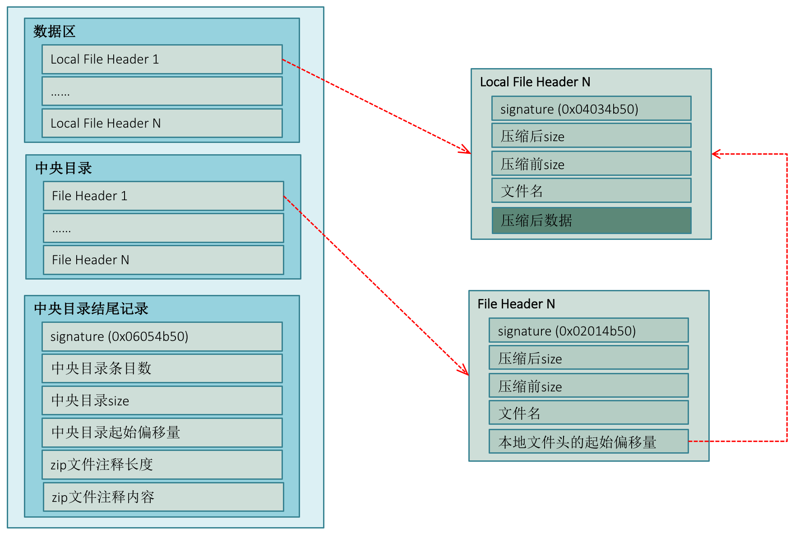
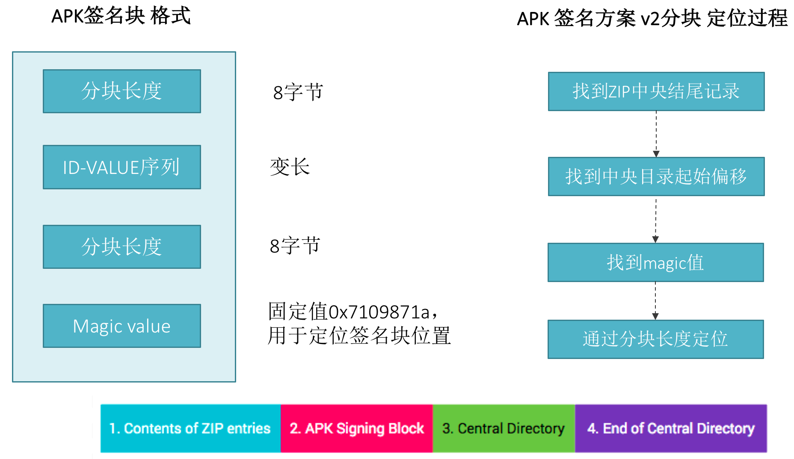
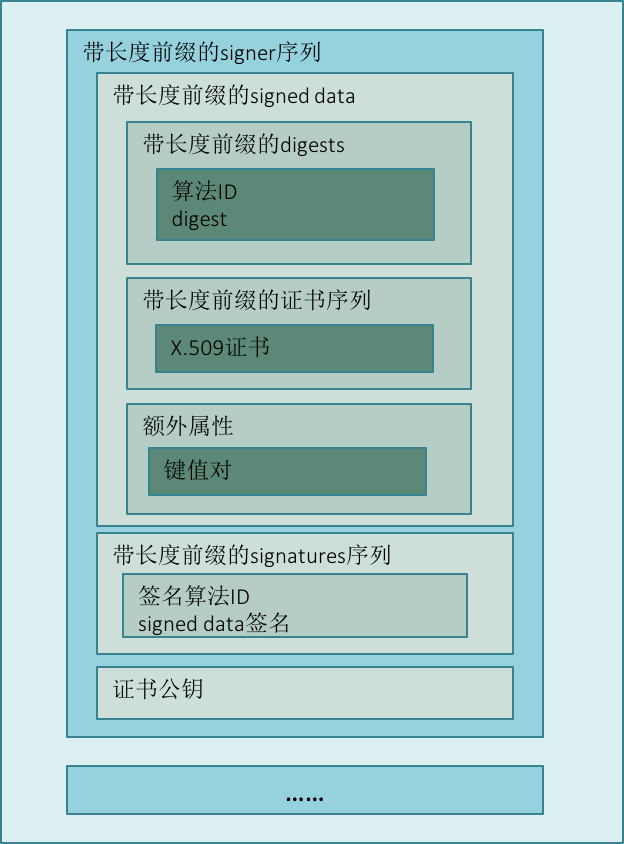
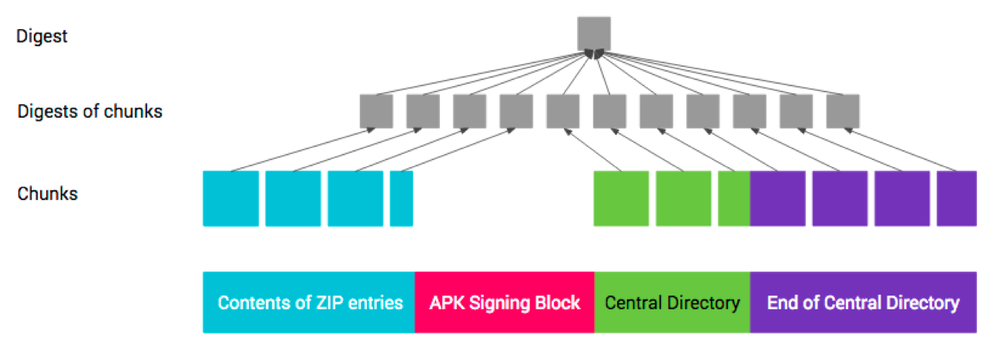
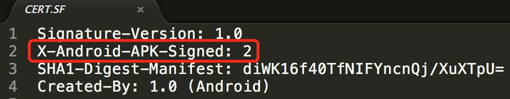

# APK签名机制之——V2签名机制详解

<br>

通过前一篇[Apk签名机制之——JAR签名机制详解](./jar_sign.md)的分析我们知道，JAR签名需要对apk内所有文件进行hash校验，当资源较多时签名验证速度较慢。为了加快验证速度并加强完整性保证，Andorid在7.0引入一种全文件签名方案V2。下面来看V2方案的具体设计原理。

# 1. V2签名设计思想

在了解V2签名结构前，先来了解下[zip（apk）文件的结构](https://pkware.cachefly.net/webdocs/APPNOTE/APPNOTE-6.2.0.txt)。

## 1.1 ZIP文件结构



zip文件分为3部分：

1. **数据区**

   此区块包含了zip中所有文件的记录，是一个列表，每条记录包含：文件名、压缩前后size、压缩后的数据等；

2. **中央目录**

   存放目录信息，也是一个列表，每条记录包含：文件名、压缩前后size、本地文件头的起始偏移量等。通过本地文件头的起始偏移量即可找到压缩后的数据；

3. **中央目录结尾记录**

   标识中央目录结尾，包含：中央目录条目数、size、起始偏移量、zip文件注释内容等。

通过中央目录起始偏移量和size即可定位到中央目录，再遍历中央目录条目，根据本地文件头的起始偏移量即可在数据区中找到相应的压缩数据。

## 1.2 V2签名原理

在[Apk签名机制之——JAR签名机制详解](./jar_sign.md)中我们已经知道，JAR签名是在apk文件中添加META-INF目录，即需要修改`数据区`、`中央目录`，因为添加文件后会导致中央目录大小和偏移量发生变化，还需要修改`中央目录结尾记录`。V2方案为加强数据完整性保证，不在`数据区`和`中央目录`中插入数据，选择在 `数据区`和`中央目录` **之间**插入一个`APK签名分块`，从而保证了原始zip（apk）数据的完整性。具体如下所示：


v2 签名块负责保护第 1、3、4 部分的完整性，以及第 2 部分包含的`APK 签名方案 v2分块`中的`signed data`分块的完整性。

## 1.3 如何定位 APK签名方案V2分块？



APK签名分块包含了4部分：分块长度、ID-VALUE序列、分块长度、固定magic值。其中`APK 签名方案 v2分块`存放在ID为0x7109871a的键值对中。在进行签名校验时，先找到zip`中央目录结尾记录`，从该记录中找到`中央目录起始偏移量`，再通过magic值即可确定前方可能是`APK签名分块`，再通过前后两个分块长度字段，即可确定`APK签名分块`的位置，最后通过ID（0x7109871a）定位`APK 签名方案 v2分块`位置。

## 1.4 APK签名方案V2分块 格式



`APK 签名方案 v2分块`是一个签名序列，说明可以使用多个签名者对同一个APK进行签名。每个签名信息中均包含了三个部分的内容：

* 带长度前缀的`signed data`

  其中包含了通过一系列算法计算的摘要列表、证书信息，以及extra信息（可选）；

* 带长度前缀的signatures序列

  通过一系列算法对`signed data`的签名列表。签名时使用了多个签名算法，在签名校验时会是选择系统支持的安全系数最高的签名进行校验；

* 证书公钥

## 1.5 摘要计算过程

前面说了v2 签名块负责保护第 1、3、4 部分的完整性，以及第 2 部分包含的`APK 签名方案 v2分块`中的 `signed data` 分块的完整性。第1、3、4部分的完整性是通过内容摘要来保护的，这些摘要保存在`signed data`分块中，而`signed data`分块的完整性是通过签名来保证的。下面来看摘要的计算过程：



第 1、3 和 4 部分的摘要采用以下计算方式，类似于两级 [Merkle 树](https://en.wikipedia.org/wiki/Merkle_tree)。 

1. 拆分chunk

   将每个部分拆分成多个大小为 1 MB大小的chunk，最后一个chunk可能小于1M。之所以分块，是为了可以通过并行计算摘要以加快计算速度；

2. 计算chunk摘要

   字节 `0xa5`  + 块的长度（字节数） + 块的内容 进行计算；

3. 计算整体摘要

   字节 `0x5a`  + chunk数 + 块的摘要的连接（按块在 APK 中的顺序）进行计算。

   **这里要注意的是**：`中央目录结尾记录`中包含了`中央目录`的起始偏移量，插入`APK签名分块`后，`中央目录`的起始偏移量将发生变化。故在校验签名计算摘要时，需要把`中央目录`的起始偏移量当作`APK签名分块`的起始偏移量。

## 1.6 v2 验证过程

来源：[APK 签名方案 v2 验证](https://source.android.com/security/apksigning/v2#v2-verification)

1. 找到`APK 签名分块`并验证以下内容：
  a. `APK 签名分块`的两个大小字段包含相同的值。
  b. `ZIP 中央目录结尾`紧跟在`ZIP 中央目录`记录后面。
  c. `ZIP 中央目录结尾`之后没有任何数据。
2. 找到`APK 签名分块`中的第一个`APK 签名方案 v2 分块`。如果 v2 分块存在，则继续执行第 3 步。否则，回退至使用 v1 方案验证 APK。
3. 对`APK 签名方案 v2 分块`中的每个 signer 执行以下操作：
  a. 从 signatures 中选择安全系数最高的受支持 signature algorithm ID。安全系数排序取决于各个实现/平台版本。
  b. 使用 public key 并对照` signed data` 验证 signatures 中对应的 signature。（现在可以安全地解析 `signed data` 了。）
  c. 验证 digests 和 signatures 中的签名算法 ID 列表（有序列表）是否相同。（这是为了防止删除/添加签名。）
  d. 使用签名算法所用的同一种摘要算法计算 APK 内容的摘要。
  e. 验证计算出的摘要是否与 digests 中对应的 digest 相同。
  f. 验证 certificates 中第一个 certificate 的 SubjectPublicKeyInfo 是否与 public key 相同。
3. 如果找到了至少一个 signer，并且对于每个找到的 signer，第 3 步都取得了成功，APK 验证将会成功。

# 2. 兼容机制&防回滚机制

## 2.1 兼容机制

因为V2签名机制是在Android 7.0中引入的，为了使APK可在Android 7.0以下版本中安装，应先用JAR签名对APK进行签名，再用V2方案进行签名。要注意顺序一定是先JAR签名再V2签名，因为JAR签名需要修改zip`数据区`和`中央目录`的内容，先使用V2签名再JAR签名会破坏V2签名的完整性。

实际上我们在编译APK时并不需要关心这个过程，在Android Plugin for Gradle 2.2中，gradle默认会同时使用JAR签名和V2方案对APK进行签名，如果想要关闭JAR签名或V2签名，可以在build.gradle中进行配置：

```groovy
android {
    ...
    defaultConfig { ... }
    signingConfigs {
        release {
            ...
            // v1SigningEnabled false
            v2SigningEnabled false
        }
    }
}
```

在 Android 7.0 中，会优先以 v2方案验证 APK，在Android 7.0以下版本中，系统会忽略 v2 签名，仅验证 v1 签名。Android 7.0+的校验过程如下：


## 2.2 防回滚机制

因为在经过V2签名的APK中同时带有JAR签名，攻击者可能将APK的V2签名删除，使得Android系统只校验JAR签名。为防范此类攻击，V2方案规定：

>  V2签名的APK如果还带JAR签名，其 META-INF/*.SF 文件的首部中必须包含 X-Android-APK-Signed 属性。该属性的值是一组以英文逗号分隔的 APK 签名方案 ID（v2 方案的 ID 为 2）。在验证 v1 签名时，对于此组中验证程序首选的 APK 签名方案（例如，v2 方案），如果 APK 没有相应的签名，APK 验证程序必须要拒绝这些 APK。此项保护依赖于内容 META-INF/*.SF 文件受 v1 签名保护这一事实。



攻击者还可能试图删除`APK 签名方案 v2 分块`中安全系数较高的签名，从而使系统验证安全系数较低的签名。为防范此类攻击：

> 对 APK 进行签名时使用的签名算法 ID 的列表会存储在通过各个签名保护的 `signed data` 分块中。

# 3. 总结

通过[Apk签名机制之——JAR签名机制详解](./jar_sign.md)和本篇文章的分析，我们知道了：

* JAR签名是针对ZIP文件所有文件依次进行签名；
* V2方案是针对APK整体文件进行签名

**JAR签名的劣势**

* 需对所有文件进行hash校验，速度较慢；
* 只保证了APK内各文件的完整性，APK（zip包）其它内容的完整性未保证。

**V2签名的优势**

* 只需进行一次hash校验，速度快；

  不需要计算所有文件的摘要，以分块形式进行hash，支持并行计算。

* 除保证了APK内各文件的完整性，APK（zip包）中`数据区`、`中央目录`和`中央目录结尾记录`的完整性均得到了保证。

  zip文件的这三个区块均有扩展字段，JAR签名因为只校验文件hash，这部分的完整性未保证。

# 4. 回顾

现在我们可以解答[Apk签名的基本概念和用法](sign_mechanism.md)前言中提出的问题了：

> 签名校验的机制是什么？具体校验的是什么内容？

APK签名是为了保证APK的完整性和来源的真实性，分为JAR签名和V2签名两种方案。核心思想均是计算APK内容的hash，再使用签名算法对hash进行签名。校验时通过签名者公钥解密签名，再与校验者计算的APK内容hash进行比对，一致则校验通过。

<br>

> 申请第三方SDK（如微信支付）时填入的SAH1值是什么？

签名证书的指纹，在申请第三方SDK时，需填入APK包名和证书指纹，SDK开发者后台会根据这两个值生成一个key。第三方SDK在初始化时，会从系统中获取当前APK的包名、签名证书指纹以及key，然后将此指纹上传到其服务器，然后校验包名、签名证书指纹是否与此key绑定，校验通过后才进行授权。

<br>

> 目前众多的快速批量打包方案又是如何绕过签名检验的？

在V2方案出现之前，快速批量打包方案有3类：

1. 反编译APK后修改渠道值，再重新打包

   这种方案实际上是重新签名，因有反编译、重新打包、签名的过程，速度相对后两种方案较慢；

2. 将渠道信息以文件形式写入META-INF目录中

   因为META-INF目录是用来存放签名的，其本身无法加入签名校验中，在META-INF目录中添加文件不会破坏原有签名。此方案需同时修改zip`数据区`、`中央目录`和`中央目录结尾记录`；

3. 将渠道信息写到zip`中央目录结尾记录`的comment字段中

   通过前面分析zip文件结构，可以发现`中央目录结尾记录`最后`注释`字段，这部分内容在JAR签名方案中同样不在签名校验范围中，故添加注释也不会破坏原有签名。此方案只需修改`中央目录结尾记录`；


在V2方案出现之后，因同时保证了`数据区`、`中央目录`和`中央目录结尾记录`的完整性，故方案2、3均不适用了。那是不是就没有快速批量打包的可能了呢？当然不是，可以从`APK签名分块`中着手。再回过头来看一下`APK签名分块`的结构：

> * size of block，以字节数（不含此字段）计 (uint64)
> * 带 uint64 长度前缀的“ID-值”对序列：
>   * ID (uint32)
>   * value（可变长度：“ID-值”对的长度 - 4 个字节）
> * size of block，以字节数计 - 与第一个字段相同 (uint64)
> * magic“APK 签名分块 42”（16 个字节）

`APK签名分块`中有一个ID-VALUE序列， 签名信息（`APK 签名方案 v2 分块`）只存储在ID 为 0x7109871a的ID-VALUE中，通过分析签名校验源码可以发现，其它ID-VALUE数据是未被解析的，也就是说除`APK 签名方案 v2 分块`外，其余ID-VALUE是不影响签名校验的。故可以定义一个新的ID-VALUE，将渠道信息写入`APK签名分块`中。因为V2方案只保证了第1、3、4部分和第 2 部分（`APK签名分块`）包含的`APK 签名方案 v2分块`中的 `signed data` 分块的完整性。新写入的ID-VALUE不受保护，所以此方案可行。实际上美团新一代渠道包生成工具[Walle](https://tech.meituan.com/android_apk_v2-signature_scheme.html)就是以这个方案实现的。

<br>

好了，到这里APK签名机制的全部内部就分析完了，相信大家看完这三篇文章之后，对JAR签名和V2签名机制都有了大致的了解，有兴趣的同学可以阅读签名和校验的源码进一步分析。

<br>

<br>

1. [Apk签名的基本概念和用法](sign_mechanism.md)
2. [Apk签名机制之——JAR签名机制详解](./jar_sign.md)
3. [Apk签名机制之——V2签名机制详解（本篇）](./apk_sign.md)

