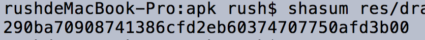
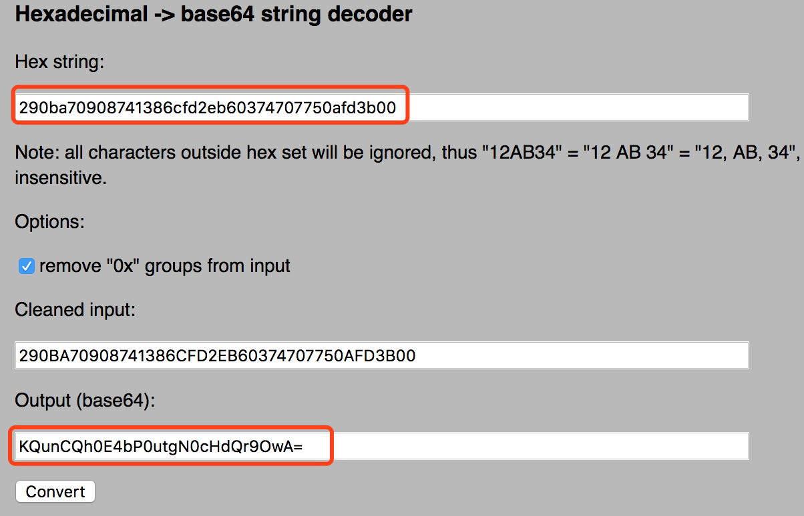
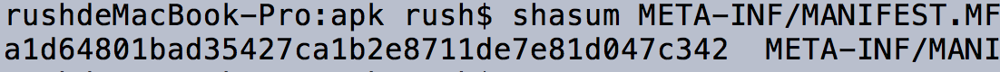
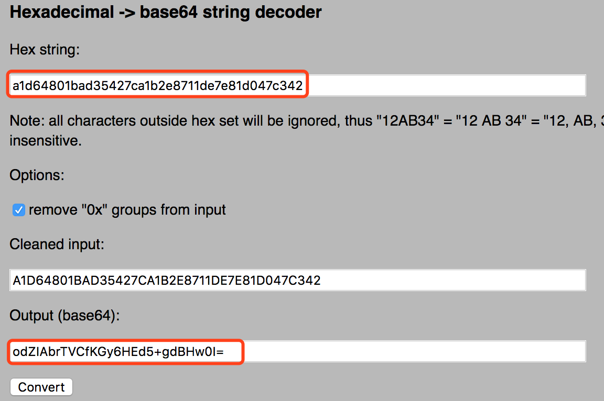
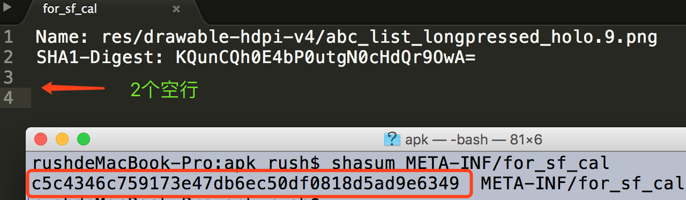
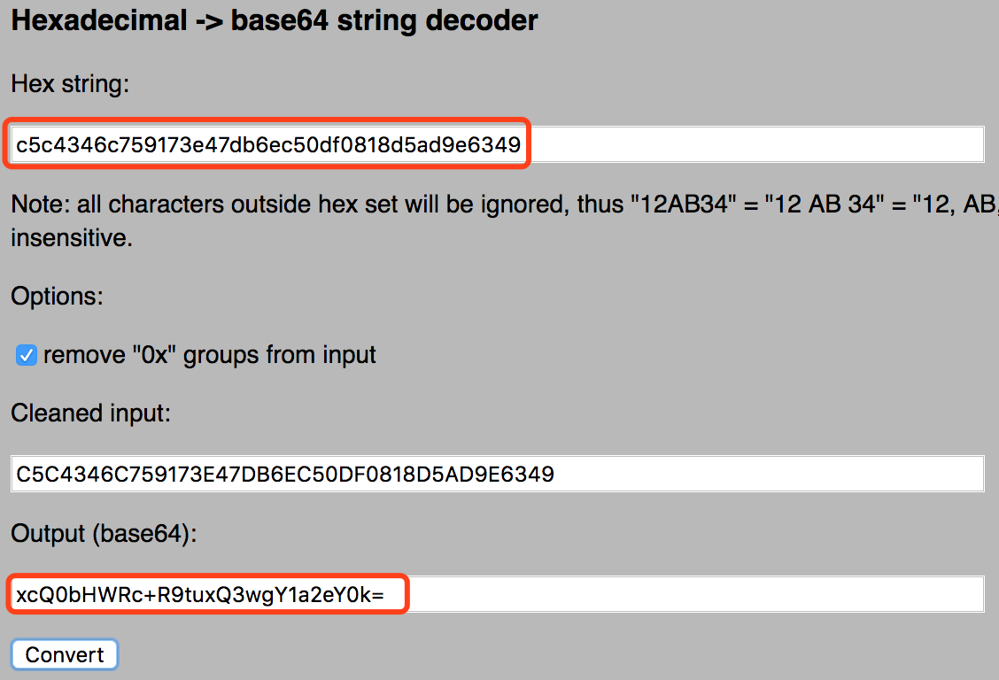
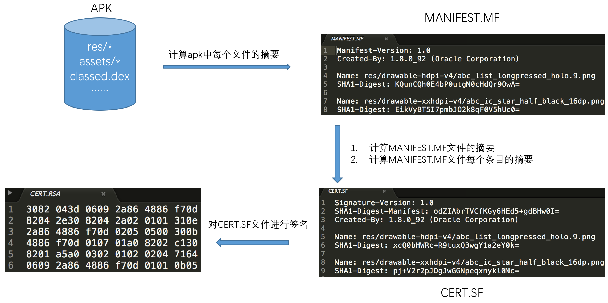

# APK签名机制之——JAR签名机制详解

<br>

在[APK签名机制原理详解](./APK签名机制原理详解.md)中我们已经了解了APK签名和校验的基本过程，这一篇我们来分析JAR签名机制。JAR签名对对jar包进行签名的一种机制，由于jar包apk本质上都是zip包，所以可以应用到对apk的签名。

# 1. 签名过程


通过解压工具打开apk文件，会发现有一个META-INF目录，该目录中有3个文件，这3个文件是签名以后生成的，显然与签名相关，我们依次看这几个文件中的内容。

## 1.1 文件内容解析

### 1.1.1 先看MANIFEST.MF：

```xml
Manifest-Version: 1.0
Created-By: 1.8.0_92 (Oracle Corporation)

Name: res/drawable-hdpi-v4/abc_list_longpressed_holo.9.png
SHA1-Digest: KQunCQh0E4bP0utgN0cHdQr9OwA=

Name: res/drawable-xxhdpi-v4/abc_ic_star_half_black_16dp.png
SHA1-Digest: EikVyBT5I7pmbJO2k8qF0V5hUc0=

......
```

这个文件列出了apk中所有的文件，以及它们的摘要，摘要字符串是通过base64编码的，通过计算来验证下：

先计算出res/drawable-hdpi-v4/abc_list_longpressed_holo.9.png的sha1值。



计算出的sha1值是经过16进行编码的，再把它转成base64编码，可以通过在线工具进行转换：[tomeko.net](http://tomeko.net/online_tools/hex_to_base64.php)



可以看到转换过后的base64值和MANIFEST.MF文件中内容是一样的。

### 1.1. 2 再看CERT.SF

```xml
Signature-Version: 1.0
SHA1-Digest-Manifest: odZIAbrTVCfKGy6HEd5+gdBHw0I=
Created-By: 1.8.0_92 (Oracle Corporation)

Name: res/drawable-hdpi-v4/abc_list_longpressed_holo.9.png
SHA1-Digest: xcQ0bHWRc+R9tuxQ3wgY1a2eY0k=

Name: res/drawable-xxhdpi-v4/abc_ic_star_half_black_16dp.png
SHA1-Digest: pj+V2r2pJOgJwGGNpeqxnykl0Nc=

......
```

SF文件的内容和MF比较相似，同样包含了apk所有文件的摘要，不同的是：

1. SF文件在主属性中记录了整个MF文件的摘要（SHA1-Digest-Manifest）
2. SF文件其余部分记录的是MF相应条目的摘要，也就说对MF文件相应条目再次进行了摘要计算。

我们再来验证下，首先计算出MANIFEST.MF文件的sha1值，再转换base64编码：





再来验证res/drawable-hdpi-v4/abc_list_longpressed_holo.9.png

这里要注意下，.MF文件是以空行分隔的。计算.MF各条目摘要时需要再加一个换行符，因为空行还有一个换行符（具体可参考[apksigner源码](https://android.googlesource.com/platform/build/+/7e447ed/tools/signapk/SignApk.java))。我们把abc_list_longpressed_holo.9.png条目保存到一个新文件中，先计算这个条目的sha1值：



再把sha1值转为base64编码：



### 1.1.3 再看CERT.RSA

cert.rsa中的是二进行内容，里面保存了签名者的证书信息，以及对cert.sf文件的签名。具体证书包含的内容已经在[APK签名机制原理详解](./APK签名机制原理详解.md)中作了说明，这里不再重复介绍。

## 1.2 整体签名过程

具体签名过程如下：



具体过程可参考[apksigner源码](https://android.googlesource.com/platform/build/+/7e447ed/tools/signapk/SignApk.java)

```java
public static void main(String[] args) {
	......
	//生成MANIFEST.MF文件，遍历apk的所有文件，计算除META-INF目录下的
	//.SF/.RSA/.DSA文件外所有文件的摘要。
    JarEntry je;
    Manifest manifest = addDigestsToManifest(inputJar);
    // MANIFEST.MF
    je = new JarEntry(JarFile.MANIFEST_NAME);
    je.setTime(timestamp);
    outputJar.putNextEntry(je);
    manifest.write(outputJar);
    
    // 生成CERT.SF文件
    je = new JarEntry(CERT_SF_NAME);
    je.setTime(timestamp);
    outputJar.putNextEntry(je);
    ByteArrayOutputStream baos = new ByteArrayOutputStream();
    //计算MF文件摘要，及MF相应条目的摘要
    writeSignatureFile(manifest, baos);
    //计算SF文件的摘要
    byte[] signedData = baos.toByteArray();
    outputJar.write(signedData);
    
    // 生成CERT.RSA
    // 对SF文件的摘要(signedData)进行签名，将证书信息一同写入RSA文件中
    je = new JarEntry(CERT_RSA_NAME);
    je.setTime(timestamp);
    outputJar.putNextEntry(je);
    writeSignatureBlock(new CMSProcessableByteArray(signedData),
    publicKey, privateKey, outputJar);
    outputJar.close();
	......
}
```

# 2. 校验过程

上面说的是签名过程，接下来看apk安装过程是怎样进行签名校验的。校验过程和签名过程刚好相反：

1. **首先校验cert.sf文件的签名**

   计算cert.sf文件的摘要，与通过签名者公钥解密签名得到的摘要进行对比，如果一致则进入下一步；

2. **校验manifest.mf文件的完整性**

   计算manifest.mf文件的摘要，与cert.sf主属性中记录的摘要进行对比，如一致则逐一校验mf文件各个条目的完整性；

3. **校验apk中每个文件的完整性**

   逐一计算apk中每个文件（META-INF目录除外）的摘要，与mf中的记录进行对比，如全部一致，刚校验通过；

4. **校验签名的一致性**

   如果是升级安装，还需校验证书签名是否与已安装app一致。

以上步骤需要全部通过才算签名校验通过，任何一步失败都将导致校验失败。这个过程能保证apk不可被篡改吗？我们来看看篡改apk内容会发生什么：

* 篡改apk内容

  校验apk中每个文件的完整性时失败；如果是添加新文件，因为此文件的hash值在.mf和.sf中无记录，同样校验失败；

* 篡改apk内容，同时篡改manifest.mf文件相应的摘要

  校验manifest.mf文件的摘要会失败；

* 篡改apk内容，同时篡改manifest.mf文件相应的摘要，以及cert.sf文件的内容

  校验cert.sf文件的签名会失败；

* 把apk内容和签名信息一同全部篡改

  这相当于对apk进行了重新签名，在此apk没有安装到系统中的情况下，是可以正常安装的，这相当于是一个新的app；但如果进行覆盖安装，则证书不一证，安装失败。

从这里可以看出只要篡改了apk中的任何内容，都会使得签名校验失败。

# 3. 签名校验代码分析

前面介绍了签名和校验的整体流程，现在来看校验过程的代码实现。安装apk的入口在[frameworks/base/services/core/java/com/android/server/pm/PackageManagerService.java](https://android.googlesource.com/platform/frameworks/base/+/android-5.1.1_r38/services/core/java/com/android/server/pm/PackageManagerService.java)的installPackageLI方法。（注：这里参考的是5.1.1版本的源码）

在这方法中构造了一个PackageParser对象，这个类是用来解析apk文件的，具体的签名校验在这个对象的collectCertificates方法中。

```java
private void installPackageLI(InstallArgs args, PackageInstalledInfo res) {
    ......
    PackageParser pp = new PackageParser();
    pp.setSeparateProcesses(mSeparateProcesses);
    pp.setDisplayMetrics(mMetrics);
    final PackageParser.Package pkg;
    try {
        pkg = pp.parsePackage(tmpPackageFile, parseFlags);
    } catch (PackageParserException e) {
        res.setError("Failed parse during installPackageLI", e);
        return;
    }

    // Mark that we have an install time CPU ABI override.
    pkg.cpuAbiOverride = args.abiOverride;
    String pkgName = res.name = pkg.packageName;
    if ((pkg.applicationInfo.flags&ApplicationInfo.FLAG_TEST_ONLY) != 0) {
        if ((installFlags & PackageManager.INSTALL_ALLOW_TEST) == 0) {
            res.setError(INSTALL_FAILED_TEST_ONLY, "installPackageLI");
            return;
        }
    }
    
    try {
        pp.collectCertificates(pkg, parseFlags);
        pp.collectManifestDigest(pkg);
    } catch (PackageParserException e) {
        res.setError("Failed collect during installPackageLI", e);
        return;
    }
```

## 3.1 校验.SF文件签名

```java
private static void collectCertificates(Package pkg, File apkFile, int flags) throws PackageParserException {
    final String apkPath = apkFile.getAbsolutePath();
    StrictJarFile jarFile = null;
    try {
        jarFile = new StrictJarFile(apkPath);
	......
}
```

这个方法中创建了一个StrictJarFile对象，在StrictJarFile的构造方法中完成了CERT.SF文件的签名校验和MANIFEST.MF文件的hash校验，校验的结果保存在了isSigned成员变量中。

```java
public StrictJarFile(String fileName) throws IOException {
    this.nativeHandle = nativeOpenJarFile(fileName);
    this.raf = new RandomAccessFile(fileName, "r");

    try {
        // Read the MANIFEST and signature files up front and try to
        // parse them. We never want to accept a JAR File with broken signatures
        // or manifests, so it's best to throw as early as possible.
        HashMap<String, byte[]> metaEntries = getMetaEntries();
        this.manifest = new Manifest(metaEntries.get(JarFile.MANIFEST_NAME), true);
        this.verifier = new JarVerifier(fileName, manifest, metaEntries);
		//校验.SF文件签名和.MF hash
        isSigned = verifier.readCertificates() && verifier.isSignedJar();
    } catch (IOException ioe) {
        nativeClose(this.nativeHandle);
        throw ioe;
    }

    guard.open("close");
}
```

StrictJarFile中构造了Manifest和JarVerifier对象，具体校验过程是中在readCertificates方法中实现的，校验成功后将证书保存到了certificates集合中。来看readCertificates方法的具体实现：

```java
synchronized boolean readCertificates() {
    if (metaEntries.isEmpty()) {
        return false;
    }

    Iterator<String> it = metaEntries.keySet().iterator();
    while (it.hasNext()) {
        String key = it.next();
        if (key.endsWith(".DSA") || key.endsWith(".RSA") || key.endsWith(".EC")) {
            verifyCertificate(key);
            it.remove();
        }
    }
    return true;
}
```

如果meta条目为空，则直接返回false；如果存在，则遍历找到签名块文件（.DSA/.RSA/.EC），依次进行校验。apk签名通常使用RSA算法，所以找到的是.RSA文件，从这里可以看出，.RSA文件名并不是固定的，校验过程中是通常后缀查找的。这里是一个while循环，从这里可以看出，是可以有多个签名者对apk进行签名的，readCertificates会依次对每一个签名进行校验。

继续看verifyCertificate的实现：

```java
private void verifyCertificate(String certFile) {
    // Found Digital Sig, .SF should already have been read
    String signatureFile = certFile.substring(0, certFile.lastIndexOf('.')) + ".SF";
    byte[] sfBytes = metaEntries.get(signatureFile);
    if (sfBytes == null) {
        return;
    }

    byte[] manifestBytes = metaEntries.get(JarFile.MANIFEST_NAME);
    // Manifest entry is required for any verifications.
    if (manifestBytes == null) {
        return;
    }

    byte[] sBlockBytes = metaEntries.get(certFile);
    try {
        //校验sf文件签名
        Certificate[] signerCertChain = JarUtils.verifySignature(
            new ByteArrayInputStream(sfBytes),
            new ByteArrayInputStream(sBlockBytes));
        if (signerCertChain != null) {
            certificates.put(signatureFile, signerCertChain);
        }
	....
}
```

首先通过.RSA文件名找到.SF文件，然后通过JarUtils类的verifySignature方法校验.SF文件签名。校验过后把相应证书保存到了certificates成员变量。

```java
public static Certificate[] verifySignature(InputStream signature, InputStream signatureBlock) throws IOException, GeneralSecurityException {
        ......
        byte[] computedDigest = md.digest(sfBytes);
        if (!Arrays.equals(existingDigest, computedDigest)) {
            throw new SecurityException("Incorrect MD");
        }
        if (!sig.verify(sigInfo.getEncryptedDigest())) {
            throw new SecurityException("Incorrect signature");
        }
        return createChain(certs[issuerSertIndex], certs);
    }
```

verifySignature方法入参分别是.SF文件和签名块（.RSA文件）的二进制流，这个方法中计算了.SF文件的摘要，对其签名做了校验。

## 3.2 校验.MF文件hash及.MF文件各条目hash

继续看verifyCertificate方法的后半段实现：

```java
private void verifyCertificate(String certFile) {
    ......
    // Use .SF to verify the whole manifest.
    String digestAttribute = createdBySigntool ? "-Digest" : "-Digest-Manifest";
    if (!verify(attributes, digestAttribute, manifestBytes, 0, manifestBytes.length, false, false)) {
        Iterator<Map.Entry<String, Attributes>> it = entries.entrySet().iterator();
        while (it.hasNext()) {
            Map.Entry<String, Attributes> entry = it.next();
            Manifest.Chunk chunk = manifest.getChunk(entry.getKey());
            if (chunk == null) {
                return;
            }
            if (!verify(entry.getValue(), "-Digest", manifestBytes,
                        chunk.start, chunk.end, createdBySigntool, false)) {
                throw invalidDigest(signatureFile, entry.getKey(), jarName);
            }
        }
    }
    metaEntries.put(signatureFile, null);
    signatures.put(signatureFile, entries);
}
```

verifyCertificate方法的后半段做了2个事情：第一件是找到.SF文件的SHA1-Digest-Manifest属性值，校验.MF文件hash的正确性；第二件是针对.SF文件中的每个条目，校验.MF文件相应条目hash的正确性。具体校验的工作在verify方法中完成：

```java
private boolean verify(Attributes attributes, String entry, byte[] data, int start, int end, boolean ignoreSecondEndline, boolean ignorable) {
    for (int i = 0; i < DIGEST_ALGORITHMS.length; i++) {
        String algorithm = DIGEST_ALGORITHMS[i];
        String hash = attributes.getValue(algorithm + entry);
        if (hash == null) {
            continue;
        }

        MessageDigest md;
        try {
            md = MessageDigest.getInstance(algorithm);
        } catch (NoSuchAlgorithmException e) {
            continue;
        }
        if (ignoreSecondEndline && data[end - 1] == '\n' && data[end - 2] == '\n') {
            md.update(data, start, end - 1 - start);
        } else {
            md.update(data, start, end - start);
        }
        byte[] b = md.digest();
        byte[] hashBytes = hash.getBytes(StandardCharsets.ISO_8859_1);
        return MessageDigest.isEqual(b, Base64.decode(hashBytes));
    }
    return ignorable;
}
```

这里进行了一次for循环来找到.SF文件使用的hash算法，校验的过程很简单，用相应hash算法计算.MF文件相应条目的摘要，比较是否一致即可。至此完成了对.MF文件hash及.MF文件各条目hash的校验。

## 3.3 校验apk中各文件的hash

继续看的PackageParser collectCertificates方法：
```java
private static void collectCertificates(Package pkg, File apkFile, int flags)
    throws PackageParserException {
    final String apkPath = apkFile.getAbsolutePath();

    StrictJarFile jarFile = null;
    try {
        jarFile = new StrictJarFile(apkPath);

        // Always verify manifest, regardless of source
        final ZipEntry manifestEntry = jarFile.findEntry(ANDROID_MANIFEST_FILENAME);
        if (manifestEntry == null) {
            throw new PackageParserException(INSTALL_PARSE_FAILED_BAD_MANIFEST,
                                             "Package " + apkPath + " has no manifest");
        }

        final List<ZipEntry> toVerify = new ArrayList<>();
        toVerify.add(manifestEntry);

        // If we're parsing an untrusted package, verify all contents
        if ((flags & PARSE_IS_SYSTEM) == 0) {
            final Iterator<ZipEntry> i = jarFile.iterator();
            while (i.hasNext()) {
                final ZipEntry entry = i.next();

                if (entry.isDirectory()) continue;
                if (entry.getName().startsWith("META-INF/")) continue;
                if (entry.getName().equals(ANDROID_MANIFEST_FILENAME)) continue;

                toVerify.add(entry);
            }
        }

        // Verify that entries are signed consistently with the first entry
        // we encountered. Note that for splits, certificates may have
        // already been populated during an earlier parse of a base APK.
        for (ZipEntry entry : toVerify) {
            final Certificate[][] entryCerts = loadCertificates(jarFile, entry);
            if (ArrayUtils.isEmpty(entryCerts)) {
                throw new PackageParserException(INSTALL_PARSE_FAILED_NO_CERTIFICATES,
                                                 "Package " + apkPath + " has no certificates at entry "
                                                 + entry.getName());
            }
            final Signature[] entrySignatures = convertToSignatures(entryCerts);

            if (pkg.mCertificates == null) {
                pkg.mCertificates = entryCerts;
                pkg.mSignatures = entrySignatures;
                pkg.mSigningKeys = new ArraySet<PublicKey>();
                for (int i=0; i < entryCerts.length; i++) {
                    pkg.mSigningKeys.add(entryCerts[i][0].getPublicKey());
                }
            } else {
                if (!Signature.areExactMatch(pkg.mSignatures, entrySignatures)) {
                    throw new PackageParserException(
                        INSTALL_PARSE_FAILED_INCONSISTENT_CERTIFICATES, "Package " + apkPath
                        + " has mismatched certificates at entry "
                        + entry.getName());
                }
            }
        }
	......
}
```

在通过StrictJarFile构造方法完成.SF和.MF文件的校验之后，首先查找AndroidManifest.xml文件是否存在，不存在则直接抛出异常；然后遍历apk中的条个文件，把除META-INF目录之外的文件加入toVerify集合，然后对toVerity集合中的每一个文件进行校验。先来看loadCertificates方法：

```java
private static Certificate[][] loadCertificates(StrictJarFile jarFile, ZipEntry entry)
    throws PackageParserException {
    InputStream is = null;
    try {
        // We must read the stream for the JarEntry to retrieve its certificates.
        is = jarFile.getInputStream(entry);
        readFullyIgnoringContents(is);
        return jarFile.getCertificateChains(entry);
    } catch (IOException | RuntimeException e) {
        throw new PackageParserException(INSTALL_PARSE_FAILED_UNEXPECTED_EXCEPTION, "Failed reading " + entry.getName() + " in " + jarFile, e);
    } finally {
        IoUtils.closeQuietly(is);
    }
}
```

再看StrictJarFile的getInputStream方法：

```java
public InputStream getInputStream(ZipEntry ze) {
    final InputStream is = getZipInputStream(ze);
    if (isSigned) {
        JarVerifier.VerifierEntry entry = verifier.initEntry(ze.getName());
        if (entry == null) {
            return is;
        }
        return new JarFile.JarFileInputStream(is, ze.getSize(), entry);
    }
    return is;
}
```

在getInputStream判断了isSigned，这个字段在StrictJarFile构造方法中校验.SF文件和.MF后赋值为true。通过JarVerifier的initEntry方法拿到了VerifierEntry对象，再来看initEntry的实现：

```java
VerifierEntry initEntry(String name) {
    // If no manifest is present by the time an entry is found,
    // verification cannot occur. If no signature files have
    // been found, do not verify.
    if (manifest == null || signatures.isEmpty()) {
        return null;
    }

    Attributes attributes = manifest.getAttributes(name);
    // entry has no digest
    if (attributes == null) {
        return null;
    }

    ArrayList<Certificate[]> certChains = new ArrayList<Certificate[]>();
    Iterator<Map.Entry<String, HashMap<String, Attributes>>> it = signatures.entrySet().iterator();
    while (it.hasNext()) {
        Map.Entry<String, HashMap<String, Attributes>> entry = it.next();
        HashMap<String, Attributes> hm = entry.getValue();
        if (hm.get(name) != null) {
            // Found an entry for entry name in .SF file
            String signatureFile = entry.getKey();
            Certificate[] certChain = certificates.get(signatureFile);
            if (certChain != null) {
                certChains.add(certChain);
            }
        }
    }

    // entry is not signed
    if (certChains.isEmpty()) {
        return null;
    }
    Certificate[][] certChainsArray = certChains.toArray(new Certificate[certChains.size()][]);

    for (int i = 0; i < DIGEST_ALGORITHMS.length; i++) {
        final String algorithm = DIGEST_ALGORITHMS[i];
        final String hash = attributes.getValue(algorithm + "-Digest");
        if (hash == null) {
            continue;
        }
        byte[] hashBytes = hash.getBytes(StandardCharsets.ISO_8859_1);

        try {
            return new VerifierEntry(name, MessageDigest.getInstance(algorithm), hashBytes,
                                     certChainsArray, verifiedEntries);
        } catch (NoSuchAlgorithmException ignored) {
        }
    }
    return null;
}
```

这个方法做了2件事情：一是遍历.SF文件中已经过签名校验的条目（signatures map是在verifyCertificate中校验.SF文件后保存的），查找是否存在方法入参指定的文件名，不存在则说明是新增文件，直接返回null；第二件事是构造VerifierEntry对象，参数分别是 文件名、hash算法、.MF文件中相应文件名对应的hash值、证书链、已签名的文件列表。

getInputStream在创建VerifierEntry对象后，进行了一次封装，返回了JarFile.JarFileInputStream对象。再回头来看PackageParser的loadCertificates中调用的readFullyIgnoringContents方法：

```java
public static long readFullyIgnoringContents(InputStream in) throws IOException {
    byte[] buffer = sBuffer.getAndSet(null);
    if (buffer == null) {
        buffer = new byte[4096];
    }
    int n = 0;
    int count = 0;
    while ((n = in.read(buffer, 0, buffer.length)) != -1) {
        count += n;
    }
    sBuffer.set(buffer);
    return count;
}
```

这个方法看上去只是读取文件流，但实际上in是JarFileInputStream，来看JarFileInputStream中read方法的实现：

```java
public int read() throws IOException {
    if (done) {
        return -1;
    }
    if (count > 0) {
        int r = super.read();
        if (r != -1) {
            entry.write(r);
            count--;
        } else {
            count = 0;
        }
        if (count == 0) {
            done = true;
            entry.verify();
        }
        return r;
    } else {
        done = true;
        entry.verify();
        return -1;
    }
}
```

可以看到，read方法中调用了VerifierEntry的verify方法，最终在verify方法中完成了apk中相应文件的hash校验，也就比较apk中各文件的hash与.MF文件中对应的值是否一致。

```java
void verify() {
    byte[] d = digest.digest();
    if (!MessageDigest.isEqual(d, Base64.decode(hash))) {
        throw invalidDigest(JarFile.MANIFEST_NAME, name, name);
    }
    verifiedEntries.put(name, certChains);
}
```

再回头来看collectCertificates方法的剩余部分：

```java
private static void collectCertificates(Package pkg, File apkFile, int flags)
    throws PackageParserException {
    ......
    // Verify that entries are signed consistently with the first entry
    // we encountered. Note that for splits, certificates may have
    // already been populated during an earlier parse of a base APK.
    for (ZipEntry entry : toVerify) {
        final Certificate[][] entryCerts = loadCertificates(jarFile, entry);
        if (ArrayUtils.isEmpty(entryCerts)) {
            throw new PackageParserException(INSTALL_PARSE_FAILED_NO_CERTIFICATES,
                                             "Package " + apkPath + " has no certificates at entry "
                                             + entry.getName());
        }
        final Signature[] entrySignatures = convertToSignatures(entryCerts);

        if (pkg.mCertificates == null) {
            pkg.mCertificates = entryCerts;
            pkg.mSignatures = entrySignatures;
            pkg.mSigningKeys = new ArraySet<PublicKey>();
            for (int i=0; i < entryCerts.length; i++) {
                pkg.mSigningKeys.add(entryCerts[i][0].getPublicKey());
            }
        } else {
            if (!Signature.areExactMatch(pkg.mSignatures, entrySignatures)) {
                throw new PackageParserException(
                    INSTALL_PARSE_FAILED_INCONSISTENT_CERTIFICATES, "Package " + apkPath
                    + " has mismatched certificates at entry "
                    + entry.getName());
            }
        }
    }
   ......
}
```

遍历toVerify集合时，如果loadCertificates返回null，说明该文件是在对apk签名过后新增的文件，抛出异常。紧接着后面再次作了校验，对比后续文件的证书签名和第一个文件的证书签名是否一致，如有不一致仍然抛出异常。

到这一步为止，签名校验的工作基本就结束了，PackageManagerService.java的installPackageLI方法还有一步是针对升级安装的场景，校验证书公钥是否一致。

```java
private void installPackageLI(InstallArgs args, PackageInstalledInfo res) {
    ......
    if (!checkUpgradeKeySetLP(ps, pkg)) {
        res.setError(INSTALL_FAILED_UPDATE_INCOMPATIBLE, "Package "  + pkg.packageName + " upgrade keys do not match the " + "previously installed version");
        return;
    }
    ......
}
```

## 3.4 签名校验时序图 

好了，到这里签名校验的代码介绍就结束了，代码比较乱，梳理一下时序图：


# 4. JAR签名机制的劣势

从Android 7.0开始，Android支持了一套全新的V2签名机制，为什么要推出新的签名机制呢？通过前面的分析，可以发现JAR签名有两个地方可以改进：

1. 签名校验速度慢

   校验过程中需要对apk中所有文件进行摘要计算，在apk资源很多、性能较差的机器上签名校验会花费较长时间，导致安装速度慢；

2. 完整性保障不够

   META-INF目录用来存放签名，自然此目录本身是不计入签名校验过程的，可以随意在这个目录中添加文件，比如一些快速批量打包方案就选择在这个目录中添加渠道文件。

为了解决这两个问题，Android 7.0推出了全新的签名方案V2，关于V2签名机制的详解参见下一篇文章[V2签名机制](./apk_sign.md)